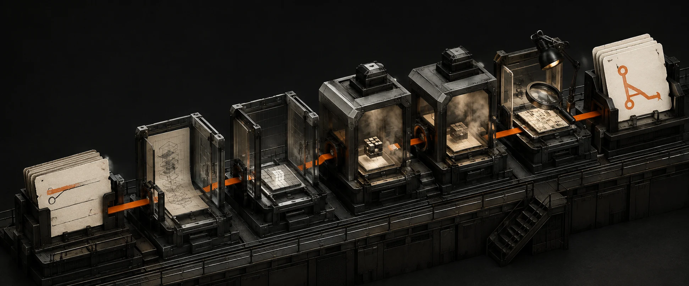

<p align="center">
  
</p>

<h1 align="center">swfactory</h1>

<p align="center"><strong>Turn an issue into a governed pull request.</strong></p>

<p align="center">
  <a href="https://github.com/zozo123/ariflow-swfactory/actions/workflows/ci.yml"></a>
  <a href="https://airflow.apache.org/docs/apache-airflow/3.3.1/"></a>
  <a href="https://www.python.org/downloads/release/python-3120/"></a>
  <a href="LICENSE"></a>
  <a href="https://skills.sh/zozo123/ariflow-swfactory"></a>
</p>

`swfactory` is a change-manufacturing line built on Apache Airflow 3. Airflow controls the run.
An agent works inside an isolated cell. Git stores the evidence. A human keeps the merge key.

```text
ISSUE -> INTENT GATE -> SPEC -> PLAN GATE -> BUILD / VERIFY -> REVIEW
      -> VALIDATED PATCH -> PULL REQUEST -> HUMAN MERGE -> METRICS
```

This is not an autonomous merge bot. It is infrastructure for making agent-authored change
observable, bounded, repeatable, and rejectable.

[Explore the control room](https://zozo123.github.io/ariflow-swfactory/) ·
[Read the design](docs/design.md) ·
[Inspect historical run PR #3](https://github.com/zozo123/ariflow-swfactory/pull/3)

## Run it

The keyless demo replays a recorded agent run through the real pipeline. It makes no model calls
and publishes only to a local bare Git remote.

```bash
git clone https://github.com/zozo123/ariflow-swfactory.git
cd ariflow-swfactory
uv sync
uv run swfactory demo
```

Run a live issue when the target, sandbox, model access, GitHub auth, and human gates are ready:

```bash
uv run swfactory doctor
uv run swfactory run \
  --blueprint factory \
  --issue 42 \
  --agent claude \
  --sandbox islo \
  --scm github \
  --approve prompt
```

## The operating model

| Phase | Authority | Durable evidence | Failure behavior |
|---|---|---|---|
| Intent | originator | verbatim `intent.md` | reject or clarify |
| Intent gate | human | actor, time, artifact digest | publish rejection evidence |
| Spec | read-only agent | testable `spec.md` | stop on invalid output |
| Plan | read-only agent | typed `plan.json` and rendered `plan.md` | stop on invalid output |
| Plan gate | human | actor, time, artifact digest | publish rejection evidence |
| Build and verify | bounded write agent | commits, fresh JUnit, invocation receipts | repair within the loop bound |
| Review | read-only agent plus policy code | structured findings and verdict | block or run one bounded fix loop |
| Deliver | trusted orchestrator | scoped patch, metrics, audit trail, PR | refuse dirty or unprovable state |
| Merge | human | GitHub review and branch policy | never automated by this project |

Each `blueprints/*.toml` file is executable governance: one CLI line and one generated Airflow DAG.
It declares stage order, gates, loop and budget limits, targets, sandbox profile, and PR labels.
Stage semantics stay in Python so a TOML edit cannot redefine what “review” or “deliver” means.

## Trust boundary

```text
TRUSTED CONTROL PLANE
Airflow · approvals · run state · GitHub credential · patch validation
                         |
                         | issue + policy in / evidence + commits out
                         v
UNTRUSTED AGENT CELL
checkout · model process · tools · package installs · target verification
```

The agent never receives the GitHub delivery credential. External identifiers and paths are
validated before they become directories, refs, or remote paths. Baselines, approvals, review
records, and cost journals remain host-owned until delivery. Missing or empty JUnit is failure.
Verification side effects and dirty non-artifact files stop the line. Delivery stages only the
approved artifact tree and passes the patch through scope and secret checks before publication.

`Scm` deliberately has no merge method.

## Sandbox fabric

The factory has one protocol: ensure, execute, read, write, exists, close. Providers keep their
real security semantics; unsupported policy is an error, never a silent downgrade.

| Runtime | Boundary | Best use | Status |
|---|---|---|---|
| `local` | none | scripted replay | built in; real agents refused by default |
| `srt` | OS confinement | keyed developer workstation | built in |
| `docker` | shared-kernel container | local reproducibility and full stacks | built in |
| `islo` | remote MicroVM | production agent cell | built in |
| `toolset` + `sbx` | Docker Sandboxes MicroVM through Airflow `SandboxBackend` | local Airflow sandbox work | adapter built in; provider and binary required |
| Daytona | hosted stateful sandbox | persistent agent cells | custom backend target; adapter not shipped |
| E2B | hosted cloud sandbox | ephemeral cells | custom backend target; adapter not shipped |
| Tensorlake | hosted MicroVM | scalable cells and verification | custom backend target; adapter not shipped |
| Box by ASCII | persistent Linux VM with Docker and desktop | large repository environments | custom backend target; adapter not shipped |

Bring any Airflow-compatible backend with:

```bash
SWF_SANDBOX=toolset \
SWF_TOOLSET_BACKEND=your_package.backends:YourSandboxBackend \
uv run swfactory run --issue 42 --agent claude --scm github
```

The adapter must prove reconnectability, bounded output, process-tree timeout, path confinement,
egress enforcement, minimal credentials, idempotent cleanup, and server-side expiry. See the
[sandbox provider contract](skills/airflow-software-factory/references/sandboxes.md).

## Factory line contract

```toml
[blueprint]
name = "factory"
version = 1

[stages]
order = ["intent", "spec", "plan", "build_and_test", "review", "deliver"]

[[gates]]
after = "intent"
artifact = "intent.md"
timeout_h = 24

[[gates]]
after = "plan"
artifact = "plan.md"
timeout_h = 24

[[targets]]
repo = "your-org/your-repo"
dir = ""
base_branch = "main"

[sandbox]
kind = "islo"
ttl_s = 172800
idle_s = 900

[limits]
max_build_iterations = 3
max_review_fixes = 1
budget_usd = 8.0

[deliver]
labels = ["factory", "agent-authored"]
```

Every target owns a `factory.toml`. It names the verification command, JUnit location, source and
test directories, and protected paths. The factory refuses to guess them.

## Compose it with Astronomer Blueprint

The optional `software_factory` template makes a governed line one reusable step in Astronomer
Blueprint YAML and the Astro IDE:

```yaml
steps:
  manufacture_change:
    blueprint: software_factory
    line: factory
    issues: ["42", "43"]
    wait_for_completion: true
```

Astronomer Blueprint owns the outer workflow; the child factory DAG retains dynamic mapping,
human gates, isolated execution, evidence, and delivery authority. Install it with
`uv sync --group airflow --group astronomer-blueprint`. See the
[composition guide](docs/astronomer-blueprint.md) and [example YAML](examples/astronomer-blueprint/product-change.dag.yaml).

## Commands

| Command | Purpose |
|---|---|
| `swfactory demo` | keyless end-to-end replay |
| `swfactory run` | run one blueprint over issues x targets |
| `swfactory doctor` | preflight a live deployment |
| `swfactory herd` | control-room TUI for runs, gates, PRs, and sandboxes |
| `swfactory approve` | answer an Airflow HITL gate |
| `swfactory webhook serve` | route trusted GitHub events into Airflow |
| `swfactory metrics` | aggregate committed run evidence |
| `swfactory maintain` | detect metric-band breaches and sweep owned sandboxes |

## Install the agent skill

The repository ships `airflow-software-factory`, a reusable skill for designing, adopting,
operating, and auditing this pattern:

```bash
npx skills add zozo123/ariflow-swfactory --skill airflow-software-factory
```

## Evidence and limits

The 2.0 rewrite received a static source and documentation audit before tagging. The version-tag
workflow is the execution gate: lint, the hermetic suite, scripted e2e demo, Airflow parity and
smoke, and package build must pass before GitHub publishes release artifacts. Its result is the
2.0 release evidence; the two PRs below remain useful 1.x operating examples.

- Historical [PR #2](https://github.com/zozo123/ariflow-swfactory/pull/2) is the honest failure
  path: the line published a labeled blocker instead of pretending success.
- Historical [PR #3](https://github.com/zozo123/ariflow-swfactory/pull/3) is the clean path: a
  verified build, zero review findings, committed receipts, and a pull request left for a human.
- `srt` and Docker share the host kernel. Docker socket access is host-root-equivalent.
- Airflow `SandboxToolset` contains command tools, not the agent loop. It is not automatically an
  agent-cell substitute.
- Private-repository cloning and provider credential delivery remain deployment responsibilities.
- The project is alpha. Read [SECURITY.md](SECURITY.md) before connecting production repositories.

## Repository map

```text
blueprints/                 policy-defined delivery lines
dags/                       generated Airflow DAGs and HITL gates
src/swfactory/              runtime, stages, adapters, state, policy, CLI
skills/airflow-software-factory/
                            installable public agent skill
examples/astronomer-blueprint/
                            optional outer-workflow composition example
.claude/hooks/              write guard and audit hook
demo/                       keyless target and recorded agent fixtures
deploy/docker/              local Airflow, webhook, and sandbox stack
deploy/islo/                production MicroVM topology
docs/                       design, deployment, eval, and control-room guides
site/                       GitHub Pages control room
```

## Documentation

- [Design and blueprint schema](docs/design.md)
- [Astronomer Blueprint composition](docs/astronomer-blueprint.md)
- [Production on islo](docs/islo.md)
- [Local Docker stack](docs/docker.md)
- [Control-room TUI](docs/herd.md)
- [Evaluation suite](docs/evals.md)
- [Contributing](CONTRIBUTING.md) and [security policy](SECURITY.md)

Apache-2.0
