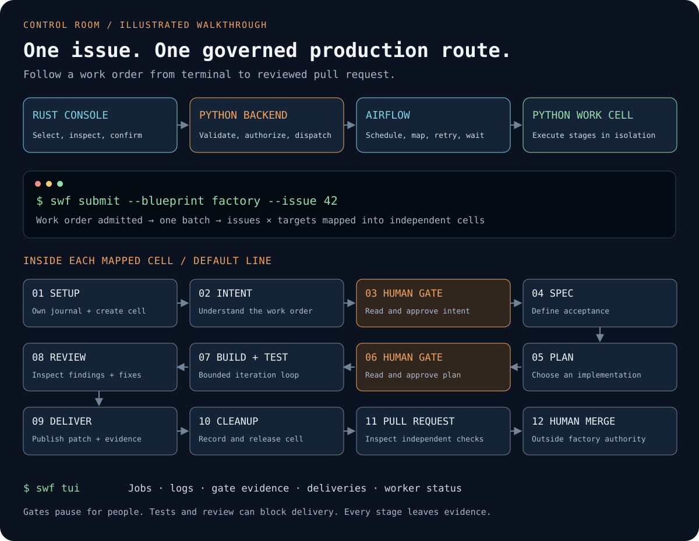

<p align="center">
  
</p>

<h1 align="center">swfactory</h1>

<p align="center"><strong>Run software work like a production system.</strong></p>

<p align="center">
  <a href="https://github.com/zozo123/ariflow-swfactory/actions/workflows/ci.yml"></a>
  <a href="https://airflow.apache.org/docs/apache-airflow/3.3.1/"></a>
  <a href="https://www.python.org/downloads/release/python-3120/"></a>
  <a href="docs/swf.md"></a>
  <a href="LICENSE"></a>
  <a href="https://skills.sh/zozo123/ariflow-swfactory/airflow-software-factory"></a>
</p>

`swfactory` turns GitHub issues into reviewed pull requests through explicit production lines,
isolated coding agents, quality checks and human approvals.

**Rust is the control room. Python is the factory backend and execution engine. Airflow is the scheduler.**

[Interactive graphical demo](https://zozo123.github.io/ariflow-swfactory/#factory-demo) ·
[Backend setup](docs/factory-backend.md) · [Operator reference](docs/swf.md) ·
[Complete deployment guide](OPERATIONS.md)

## See the whole flow

[](https://zozo123.github.io/ariflow-swfactory/#factory-demo)

This is an illustrated walkthrough, not a recorded successful run. On the website, step through
the route, inspect the command for each station, and approve the simulated gates. No account,
model call or live factory is involved in the walkthrough.

A work order creates one Airflow batch. Each **issue × target repository** becomes an independent
mapped work cell. The default route is setup, intent, intent approval, specification, plan, plan
approval, build/test, review, delivery and cleanup. Different blueprints can shorten that route.

## Try a local replay

```sh
git clone https://github.com/zozo123/ariflow-swfactory.git
cd ariflow-swfactory
uv sync
uv run swfactory demo
```

The demo uses a scripted agent, a local runner and local git. It needs no model key and makes no
model calls. It produces the artifact chain and exercises the local pipeline; it does not start
Airflow or the Rust console. [Run a real GitHub work order](OPERATIONS.md#run-it-on-a-real-github-repository)
when you are ready to configure credentials and an isolated worker.

## Connect the CLI and terminal interface

First start the Python backend on the factory host. It needs access to an existing Airflow service:

```sh
# Generate once and securely share this operator token with your console.
export SWF_BACKEND_TOKEN="$(python3 -c 'import secrets; print(secrets.token_urlsafe(32))')"
export AIRFLOW_URL=http://localhost:8080
export AIRFLOW_USER=admin
# Set AIRFLOW_PASSWORD securely, or use AIRFLOW_TOKEN.
export SWF_REPO=zozo123/ariflow-swfactory
uv run swfactory backend
```

The backend listens on loopback port 8082. For a complete local Docker deployment, set the same
backend token and run `docker compose -f deploy/docker/compose.yml --profile console up -d`.
See [setup and credential handling](docs/factory-backend.md) for remote HTTPS, workers and metrics.

On your operator machine, [install `swf`](docs/swf.md#install), set `SWF_BACKEND_TOKEN` to that same
value, then:

```sh
swf context add local --backend-url http://localhost:8082 \
  --airflow-url http://localhost:8080 --repo zozo123/ariflow-swfactory --use
swf doctor
swf submit --blueprint factory --issue 42
swf jobs list
swf gates list
swf tui
```

Use an actual issue from your configured target repository. The backend validates the installed
blueprint and target selection before submitting. In the TUI, inspect the job and its evidence,
review and answer the ready gates, then follow the delivery. CLI operators can use the exact gate
ID from `swf gates list`:

```sh
swf gates review '<gate-id>'
swf gates approve '<gate-id>'
swf deliveries list
```

Approval is explicit. A failed or unfinished gate is not permission to continue. A successful
workflow, a published PR and independently verified code remain separate claims. A human merges.

## Who owns what

| Component | Language / runtime | Responsibility |
| --- | --- | --- |
| `swf` CLI and TUI | Rust / Ratatui | Views, navigation, command parsing, review and confirmation |
| Factory API | Python / HTTP JSON `/v1` | Work-order validation, installed lines, service credentials, worker cleanup and evidence reads |
| Scheduling | Apache Airflow 3 | DAG runs, mapping, retries and waiting for human input |
| Execution | Python stages | Intent, spec, plan, coding, tests, review, publication and recovery journal |
| Work cell | islo, srt, Docker or provider adapter | Isolated agent execution; no GitHub publishing credential |

The console talks to the Python backend. The backend talks to Airflow through its public REST API;
no component reads Airflow's metadata database. Python alone publishes to GitHub. There is no second
scheduler in Rust. [Read the complete interface contract](docs/factory-backend.md).

New console contexts use the backend. Existing saved contexts retain direct-service access until
you migrate them; explicit `--direct` remains available. There is no automatic fallback to local
credentials when a backend is unavailable.

## Build a production line

A line is a versioned TOML blueprint, not another scheduler implementation:

```toml
[blueprint]
name = "factory"
version = 1

[[targets]]
repo = "your-org/your-product"
base_branch = "main"

[stages]
order = ["intent", "spec", "plan", "build_and_test", "review", "deliver"]

[[gates]]
after = "intent"
artifact = "intent.md"

[[gates]]
after = "plan"
artifact = "plan.md"
```

This excerpt shows the route and approval boundaries. Start from the complete
[default blueprint](blueprints/default.toml), set worker configuration and limits, and follow the
[production setup guide](OPERATIONS.md#run-it-on-a-real-github-repository). Airflow discovers one DAG
per installed blueprint. Runtime target selections can only narrow that blueprint's repositories.

## Operate and recover

- [Commands, TUI and bulk approvals](docs/swf.md)
- [Durable webhook intake, dispatch retries and receipts](docs/webhooks.md)
- [Run ownership, interrupted operations and journal recovery](docs/run-recovery.md)
- [Docker deployment](docs/docker.md) and [islo deployment](docs/islo.md)
- [Latest Airflow main setup](OPERATIONS.md#run-against-the-latest-airflow-main)
- [Design and trust boundaries](docs/design.md)
- [Changelog](CHANGELOG.md), [contributing](CONTRIBUTING.md) and [license](LICENSE)

## Evidence

The diagrams and website walkthrough are explanatory. For actual recorded project evidence, see
[the completed factory PR](https://github.com/zozo123/ariflow-swfactory/pull/3),
[the repository's CI runs](https://github.com/zozo123/ariflow-swfactory/actions), and the
[evidence notes](OPERATIONS.md#evidence-and-project-status). Scripted replays are labeled separately
from live agent runs and independently verified deliveries.
