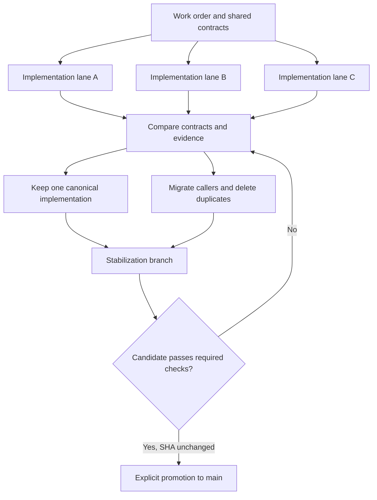
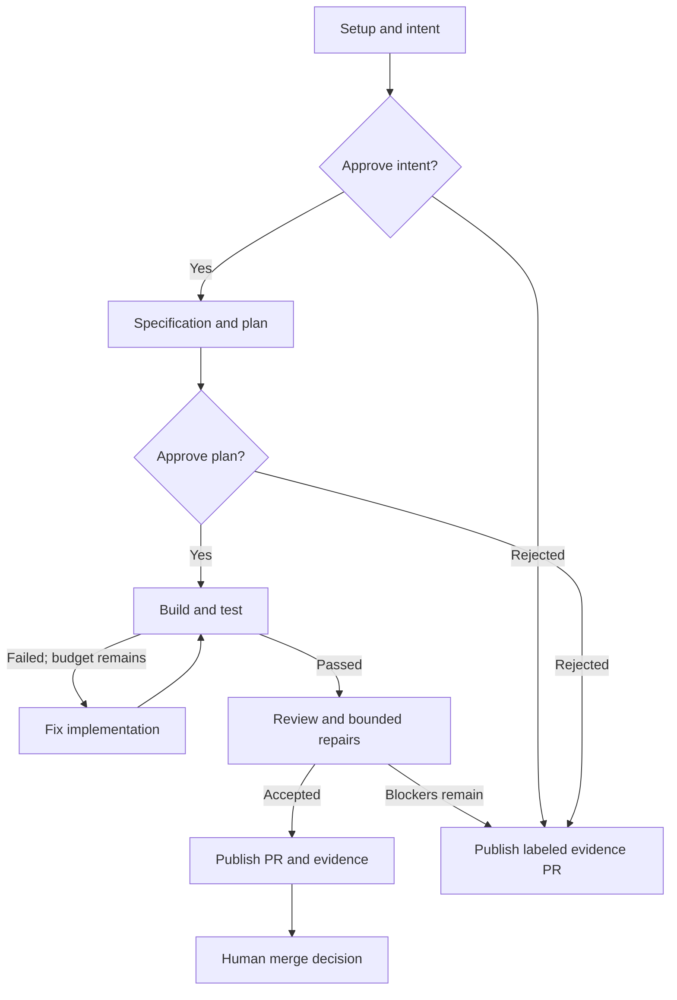

# Airflow Software Factory

**Durable intent. Disposable execution. Deterministic convergence.**

[](https://github.com/zozo123/ariflow-swfactory/actions/workflows/ci.yml)
[](pyproject.toml)
[](pyproject.toml)
[](#status-and-verification)
[](LICENSE)

Turn GitHub work orders into reviewable pull requests through a defined process: specification,
plan, human approval, implementation, tests, review, and retained evidence. Apache Airflow owns the
managed lifecycle; isolated coding workers perform the work; the trusted factory publishes the result.
People decide what reaches `main`.

[Quickstart](#quickstart) · [Liquid methodology](#the-liquid-methodology) ·
[Run a real issue](#run-a-real-issue) · [Operator guide](docs/swf.md) ·
[Interactive demo](https://zozo123.github.io/ariflow-swfactory/#factory-demo) · [Agent skills](#agent-skills)


## Quickstart

Install **Git**, **Python 3.12**, and **[uv](https://docs.astral.sh/uv/getting-started/installation/)**,
then run the bundled replay:

```sh
git clone https://github.com/zozo123/ariflow-swfactory.git
cd ariflow-swfactory
uv sync --locked
uv run swfactory demo
```

The replay uses authored agent fixtures to change a calculator project, fail a build, repair it,
review the result, and deliver to a local Git remote. Demo approvals are automatic. Dependency
installation needs network access; the replay needs **no model key, GitHub token, Airflow, Docker,
or Rust**. It makes no model calls and opens no GitHub PR.

The terminal prints the stage report and delivery location. Find the machine-readable report at
`.factory/<run_id>/report.json` and the local PR description at `.factory/<run_id>/pr.md`.

```sh
uv run swfactory state list
```

Prefer to explore visually? The [interactive walkthrough](https://zozo123.github.io/ariflow-swfactory/#factory-demo)
illustrates the workflow and approval decisions using simulated data.

## What the factory gives you

Generating a patch is one step. Delivering it repeatedly requires an explicit contract for how the
change is approved, verified, published, and recovered when execution fails.

| Need | Mechanism | Result |
| --- | --- | --- |
| Repeatable delivery | Versioned TOML blueprints and a product verification contract | The same stages, gates, and limits for each work order |
| Human control | Intent and plan approvals bound to artifact digests | Review the decision before implementation; retain who approved what |
| Parallel work | Airflow task mapping over issue × target jobs | Independent jobs with bounded concurrency |
| Bounded execution | Stage budgets, timeouts, build attempts, and review repair limits | Explicit success, refusal, or blocked outcomes |
| Recoverable ownership | Durable Factory Cells, epochs, and operation journals | Work identity survives a worker; managed mutations can be reconciled |
| Inspectable delivery | Evidence committed alongside the change; CLI/TUI inspection | Trace requirements, approvals, tests, and review back to the PR |

## The Liquid methodology

> **Create entropy where exploration benefits from it; destroy entropy before promotion.**

Liquid Software Factory applies the same discipline to running the product and developing the
factory itself: explore through independent implementation lanes, compare contracts and evidence,
then converge on one maintained implementation. **Parallelism is cheap. Authority is singular.**

| May change or disappear | Must remain durable and authoritative |
| --- | --- |
| Workers, agent sessions, sandboxes, VMs, containers | Factory Cell identity, current epoch, work order, and lifecycle binding |
| Speculative branches, experiments, temporary adapters | Approved contracts, mutation history, evidence, and publication state |
| Intermediate implementations and work graphs | The accepted plan revision and the final repository state |

The method has six operating rules:

1. **Keep one lifecycle authority.** Airflow schedules managed work; `Plan.work` describes bounded
   dependencies inside a stage. Agents, providers, admission controls, and GitHub Actions do not
   become additional lifecycle schedulers.
2. **Separate identity from compute.** A Factory Cell owns one issue × target across attempts.
   A sandbox is a temporary execution instance; replacing it does not grant new authority.
3. **Fence and reconcile mutations.** Bind effects to `(cell_id, epoch, operation_key)`. Reject stale
   writers, deduplicate retries, and observe ambiguous external outcomes before replay.
4. **Explore within limits.** Use independent lanes with clear outputs, budgets, deadlines, and
   cancellation. Domain × concern matrices reveal gaps; issue count measures coverage.
5. **Collapse before integration.** Compare alternatives against shared contracts, keep the canonical
   implementation, migrate callers, and delete superseded paths. PR boundaries follow coherent changes.
6. **Promote evidence for the exact candidate.** Validate the stabilization result, check its SHA has
   not changed, and require an explicit merge or promotion decision.



This is the development method, not a claim that the default executor launches competing sandbox
forks. The [full methodology](docs/liquid-methodology.md) defines the seven ownership roles, ten
concerns, recovery cases, capability boundaries, evidence requirements, factory generations, and
completion criteria. It also records the Liquid500 + Liquid400 fan-in and its verification limits.

## Architecture and lifecycle

| Component | Owns | Entry point |
| --- | --- | --- |
| Apache Airflow | Managed lifecycle scheduling, mapped jobs, retries, and human approval waits | [Blueprint DAGs](dags/blueprints.py) |
| Factory Cell control plane | Durable issue × target identity, epoch, and managed mutation records | [Cells](src/swfactory/cells.py), [backend](src/swfactory/backend/) |
| Python `swfactory` | Stage execution, verification, trusted publication, local replay, and backend service | [Runtime](src/swfactory/runtime.py), [stages](src/swfactory/stages.py) |
| Rust `swf` | Operator CLI/TUI for submission, gates, inspection, and delivery verification | [Operator reference](docs/swf.md) |
| Agent and sandbox adapters | Stage-scoped work in replaceable compute | [Execution design](docs/design.md) |

One submission creates an Airflow run. Each **issue × selected target** becomes a mapped job.
Installed blueprints define DAGs; new issues supply data rather than new Python DAG definitions.
The [default blueprint](blueprints/default.toml) follows this delivery route:



Metrics and teardown surround this route. Exhausted build attempts and policy failures stop
progression. Rejected gates or unresolved review blockers can produce a `[REJECTED]` or `[BLOCKED]`
evidence PR; publication alone does not mean acceptance.

`Plan.work` validates up to 64 issue-specific nodes, their dependencies, and declared files.
`parallel_safe` marks fork candidates. The default stage path still uses one governed build/review
cell; provider-native fork execution requires additional integration and lineage evidence.
See [managed lifecycle and fork semantics](docs/lifecycle.md).

### What arrives with a change

Evidence is committed under `docs/factory/<issue>/`, relative to the product target directory.
Which artifacts exist depends on how far execution progressed.

| Artifact | Purpose |
| --- | --- |
| `intent.md`, `spec.md` | Original work order, requirements, and open questions |
| `plan.md`, `plan.json` | Planned files, steps, tests, risks, and optional work graph |
| `approvals.json` | Gate decision, actor, time, and approved artifact digest |
| `review.json` | Review verdict, findings, and remaining blockers |
| `metrics.json` | Recorded timing, spend, and delivery signals |
| `agent/` | Agent result envelopes and copied audit records |

Host journals under `.factory/` are control state, kept outside the coding agent's authority.
The [delivery verifier](docs/swf.md) treats workflow completion, PR publication, and independent
verification as separate results.

## Run a real issue

Start with a repository you can use for evaluation. The project is **alpha**. A real run requires
configured GitHub access, a supported agent environment, and model/provider credentials; it can
incur costs and publish a PR.

### 1. Define how the product is verified

Add `factory.toml` at the product target's root. For a Python project with pytest in its `dev` group:

```toml
[commands]
test = "uv run --group dev pytest --junitxml=.factory/junit.xml"
lint = "uv run --group dev python -m compileall -q src"

[paths]
source = "src"
tests = "tests"
junit = ".factory/junit.xml"
protected = ["factory.toml", ".github/"]
```

Adapt the commands and paths to the product. Tests must run non-interactively, return a nonzero
exit code on failure, and produce fresh JUnit XML. The factory refuses a target without this
contract. See the [bundled example](demo/target/factory.toml).

### 2. Configure the factory line

Copy [blueprints/default.toml](blueprints/default.toml) to `blueprints/your-product.toml`. Set
`[blueprint].name = "your-product"`, choose the target `repo` and `base_branch`, and use `dir = ""`
for a repository-root target. The supplied line targets this repository's calculator demo.

The defaults are two approval gates with 24-hour timeouts, three build attempts, one review repair
round, a $2 model budget per stage and $8 per job, a three-hour stage timeout, and four concurrent
mapped jobs. These are configured limits, not cost or latency measurements. Operational `SWF_*`
settings can override line defaults. Submitted targets can only narrow the installed line's scope.

### 3. Deploy, connect, and submit

Follow [real-repository setup](OPERATIONS.md#run-it-on-a-real-github-repository), then the
[Docker rehearsal](docs/docker.md) or [hosted islo deployment](docs/islo.md). Configure the
[factory backend](docs/factory-backend.md) with installed blueprints, Airflow access, and service
credentials. Its default address is loopback port `8082`.

[Install the Rust console](docs/swf.md#install) and set `SWF_BACKEND_TOKEN` on the operator machine
to the same secret configured on the backend. With the services running:

```sh
swf context add local --backend-url http://localhost:8082 \
  --airflow-url http://localhost:8080 --repo your-org/your-product --use
swf doctor
swf submit --blueprint your-product --issue 42
swf attention
swf gates list
swf tui
```

Use a real issue number from the configured product repository. Review individual gates with
`swf gates review '<gate-id>'`, then answer with `swf gates approve '<gate-id>'` using the exact
ID returned by `swf gates list`. Gate writes recheck readiness and the TUI binds the decision to
the evidence revision under review. Inspect published results with `swf deliveries list`.

<details>
<summary>Direct CLI rehearsal without an Airflow service</summary>

After configuring the line and the islo/Claude/GitHub environment described above:

```sh
uv run swfactory doctor \
  --blueprint your-product --agent claude --sandbox islo --scm github
uv run swfactory run \
  --blueprint your-product --issue 42 \
  --agent claude --sandbox islo --scm github --approve prompt
```

This invokes the shared Python stages directly with terminal approvals. It can publish a real PR.
It does not provide a backend-managed Airflow lifecycle or establish managed Cell authority merely
by sharing stage code. Use the deployed path for managed concurrency, durable approval waits, and
centralized publication.

</details>

## Execution and trust boundaries

Coding agents receive stage-specific tools and protected-path rules. Trusted Python code runs the
product's verification commands, validates patches, scans for secrets, and publishes. Coding
sandboxes receive no GitHub publishing credential. In backend-managed runs, GitHub publication
credentials remain on the backend and workers use its SCM proxy.

Every profile below carries its [capability claim](config/capability-inventory.json) and that
claim's support level; a profile without a claim is an integration seam, not an available sandbox.

<!-- capability-surface:sandboxes -->
| Sandbox | Capability claim | Support | Use and boundary |
| --- | --- | --- | --- |
| `local` | [`sandbox.local-scripted`](config/capability-inventory.json) | test only | Scripted replay and development; no isolation boundary |
| `srt` | [`sandbox.srt`](config/capability-inventory.json) | experimental | Anthropic Sandbox Runtime filesystem and network restrictions on the local machine |
| `docker` | [`sandbox.docker`](config/capability-inventory.json) | experimental | Container execution for development and rehearsal; shares the host kernel |
| `islo` | [`sandbox.islo`](config/capability-inventory.json) | experimental | Remote MicroVM execution with configured gateway and environment |
| `toolset` | none | adapter | Airflow common.ai sandbox adapter; capabilities depend on its configured backend |

Provider capabilities differ. A warm-start snapshot does not establish live-fork support. The
Docker rehearsal mounts the host Docker socket and belongs on a host you control. Model credentials
are supplied only through the selected agent/provider configuration; backend and publishing secrets
stay outside coding sandboxes.

The backend token grants operator authority within a trusted deployment. Context files store
credential environment-variable names, not secret values; backend failure does not silently switch
to local credentials. Stopping an Airflow run does not itself kill every process or reclaim its
sandbox. Follow the [recovery guide](docs/run-recovery.md) for inspection and cleanup, and
[SECURITY.md](SECURITY.md) for security reporting.

## Agent skills

Two repository skills cover adoption and operation. Installing a skill gives an assistant
instructions; it does not deploy Airflow or provision a backend.

| Skill | Use it for |
| --- | --- |
| [`airflow-software-factory`](skills/airflow-software-factory/SKILL.md) | Adopt, configure, deploy, and operate the factory |
| [`swfactory`](skills/swfactory/SKILL.md) | Drive an existing factory as an outer coding harness with stable session identity |

```sh
npx skills add zozo123/ariflow-swfactory --skill airflow-software-factory --skill swfactory
```

[Browse the catalog](https://skills.sh/zozo123/ariflow-swfactory) · [Installation details](skills/README.md)

For a configured harness, keep `(harness, factory_id)` stable throughout one session:

```sh
scripts/swf_harness.sh codex codex-session-17 --blueprint your-product --issue 42
```

The wrapper submits through `swf`; Airflow continues to own lifecycle scheduling. See
[harness setup](docs/harnesses.md) and [concurrent harness methodology](docs/harness-concurrency-methodology.md).

## Status and verification

This is an alpha implementation with executable delivery paths and a broader set of architectural
contracts. Read capability claims at their demonstrated level:

| Evidence | What it establishes |
| --- | --- |
| Local replay and scripted evals | Pipeline behavior, repair paths, policy outcomes, and retained artifacts |
| Cell, journal, and backend tests | The specific identity, mutation, and recovery behaviors exercised |
| Liquid bundle manifest | Declared coverage of 900 generated slices and 181 legacy ranks; not 1,081 independently proven features |
| Provider and live scheduler checks | Behavior of the tested environment and scenario; inspect each check's result |
| Native workgraph forks and recursive factories | Contracts and bounded primitives exist; these are not default end-to-end production guarantees |

### Capability claims

[`config/capability-inventory.json`](config/capability-inventory.json) is the single public truth for
every claimed feature. The table below is generated from it, each `Verified by` reference resolves to
a file or a CI job that exists, and a test refuses any sentence in this README or on the site that
describes a capability more strongly than its claim.

The experimental work executor observes cancellation before and between merge callbacks.
A merge callback already in flight is not interrupted or rolled back.

<!-- capability-inventory:start -->
<!-- Generated from config/capability-inventory.json; run `uv run python -m swfactory.capability_inventory --write`. -->

| Claim | Support | Runtime entry | Verified by |
| --- | --- | --- | --- |
| `airflow.lifecycle` | `supported` | `swfactory.backend.service.Factory.submit -> Airflow DAG run` | ci:airflow-parity required check plus scripts/stress_airflow.sh |
| `mutation.github` | `supported` | `swfactory.core_capabilities.CoreCapabilityRuntime.execute_external via ControlKernel` | tests/test_core_capabilities.py (fenced, replayed and evidenced execute_external) |
| `recovery.external-effects` | `supported` | `swfactory.idempotency.OperationJournal and swfactory.operation_recovery` | tests/test_recovery_acceptance.py |
| `workgraph.serial` | `supported` | `swfactory.work_stage.build_and_test (the Airflow build task dags/blueprints.py selects) -> bounded Plan.work execution` | tests/test_workgraph_stage_execution.py |
| `workgraph.provider-fork` | `experimental` | `swfactory.work_executor.WorkExecutor and swfactory.execution_binding` | tests/test_work_executor.py (parallel fan-out, conflict, crash and cancellation scenarios) |
| `sandbox.local-scripted` | `test_only` | `swfactory demo` | ci:test required job (its e2e demo step) plus tests/test_stages_scripted.py |
| `sandbox.srt` | `experimental` | `swfactory.sandbox.SrtSandbox` | ci:srt-smoke plus the SrtSandbox argv contracts in tests/test_sandbox_argv.py |
| `sandbox.docker` | `experimental` | `swfactory.sandbox Docker path` | ci:docker-smoke |
| `factory.generations` | `experimental` | `generation manifests and parent-owned promotion path` | tests/test_generation_contract.py |
| `sandbox.islo` | `experimental` | `swfactory.sandbox.IsloSandbox (islo use / cp / rm control plane)` | ci:evals-islo in .github/workflows/evals.yml (a real claude run inside a MicroVM) plus the hermetic argv contracts in tests/test_sandbox_argv.py |
| `selfhost.factory` | `experimental` | `swfactory run --blueprint selfhost (target dir is the repo root), executing swfactory.stages against the factory's own tree` | tests/test_selfhost.py (contract parses, every protected entry survives literal-prefix reduction, confinement modules are refused for build and fix, both gates are non-auto, one line serves both backends) |

<!-- capability-inventory:end -->

Provider-fork execution remains experimental and requires every work node to set
`parallel_safe=True`; a mixed or default plan uses serial execution.

For development, install the locked Airflow group and run the repository checks:

```sh
uv sync --locked --group airflow
uv run --group airflow ruff check .
uv run --group airflow ruff format --check .
uv run --group airflow pytest
uv run --group airflow swfactory demo
uv run --group airflow python -m swfactory.liquid_spec
uv run --group airflow python -m swfactory.evals
```

Rust contributors also run the workspace's formatting, clippy, test, and release-build checks;
see [CONTRIBUTING.md](CONTRIBUTING.md) and the [Rust workspace](rust/README.md).

[CI](.github/workflows/ci.yml) gives internal fan-out PRs the fast Python gate and main-targeted
PRs the integration matrix. The pinned live-gate, SRT, Docker, and upstream sandbox-toolset jobs
currently use `continue-on-error`; the separate [eval workflow](.github/workflows/evals.yml) is
path-filtered, scheduled, or manually triggered, and real-agent jobs need configured secrets.
**A green badge does not mean every live path passed.** The
[methodology's promotion rules](docs/liquid-methodology.md#ci-and-promotion) define the stronger
acceptance standard and explain the remaining enforcement work.

## Documentation and contribution

| Goal | Start here |
| --- | --- |
| Understand and apply Liquid development | [Methodology](docs/liquid-methodology.md) |
| Deploy or run against GitHub | [Operations](OPERATIONS.md), [Docker](docs/docker.md), [islo](docs/islo.md) |
| Run the factory against itself | [Self-hosting](docs/selfhost.md) |
| Operate Cells, jobs, approvals, and deliveries | [CLI/TUI](docs/swf.md), [backend API](docs/factory-backend.md) |
| Design lifecycle and parallel work | [Lifecycle](docs/lifecycle.md), [architecture](docs/design.md) |
| Receive work and recover interruptions | [Webhooks](docs/webhooks.md), [run recovery](docs/run-recovery.md) |
| Evaluate behavior and control proposals | [Evals](docs/evals.md), [non-equilibrium control doctrine](docs/non-equilibrium-factory.md) |
| Extend or review the factory | [Contributing](CONTRIBUTING.md), [review policy](REVIEW.md), [changelog](CHANGELOG.md) |

Contribute a coherent change with an explicit invariant, failure behavior, evidence, and a plan to
remove superseded paths. See the [repository improvement plan](https://github.com/zozo123/ariflow-swfactory/issues/2022)
for the next convergence work. Licensed under [Apache 2.0](LICENSE).
