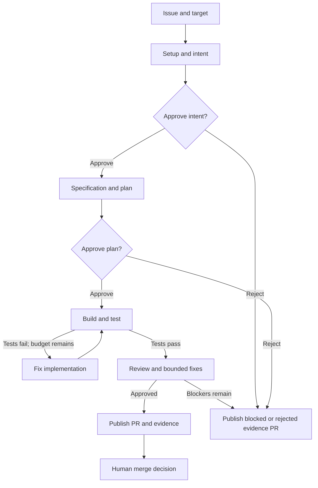

<p align="center">
  
</p>

<h1 align="center">Airflow Software Factory</h1>

<p align="center"><strong>Turn GitHub issues into tested, reviewed pull requests—with a traceable path through every decision.</strong></p>

<p align="center">
  <a href="https://github.com/zozo123/ariflow-swfactory/actions/workflows/ci.yml"></a>
  <a href="pyproject.toml"></a>
  <a href="pyproject.toml"></a>
  <a href="pyproject.toml"></a>
  <a href="LICENSE"></a>
</p>

<p align="center">
  <a href="#quickstart">Quickstart</a> ·
  <a href="https://zozo123.github.io/ariflow-swfactory/#factory-demo">Interactive demo</a> ·
  <a href="OPERATIONS.md">Deployment guide</a> ·
  <a href="docs/swf.md">CLI &amp; TUI</a> ·
  <a href="CONTRIBUTING.md">Contributing</a>
</p>

`swfactory` runs coding agents through a defined software delivery process: capture intent,
write a specification, approve a plan, implement, test, review, and publish a pull request.
Each issue gets its own work cell, bounded repair loops, and an evidence trail committed alongside
the change. People approve the intent and plan, then decide what to merge.

**Airflow schedules. Python executes and publishes. Rust gives you the control room.**

Use it when you need repeatable agent workflows across repositories, visible approval queues,
and enough evidence to understand why a change was delivered or blocked. The project is **alpha**;
start with the local replay and a repository you can use for evaluation.

## Why a software factory?

Generating a patch is one step. A repeatable delivery process also needs clear requirements,
fresh test results, bounded retries, approvals, recovery, and a record of what happened.

| You need | The factory provides |
| --- | --- |
| A repeatable process | Versioned TOML blueprints defining stages, repositories, approval gates, and limits |
| Human control | Intent and plan gates, decisions bound to artifact digests, and human merge |
| Constrained execution | Stage-specific agent tools, protected paths, isolated worker options, and separate publishing authority |
| Bounded work | Build/fix limits, review-fix limits, model budgets, timeouts, and mapped-job concurrency limits |
| Inspectable results | Specifications, plans, review findings, approvals, metrics, and agent records in the delivered branch |
| Operations beyond one run | Durable webhook intake, run journals, recovery inspection, and a shared CLI/TUI operations layer |

## Quickstart

You need **Git**, **Python 3.12**, and **[uv](https://docs.astral.sh/uv/getting-started/installation/)**.
Dependency installation needs network access; the replay itself needs no model key, GitHub token,
Docker, Airflow, or Rust.

```sh
git clone https://github.com/zozo123/ariflow-swfactory.git
cd ariflow-swfactory
uv sync --locked
uv run swfactory demo
```

The demo applies a small change to the bundled calculator project using authored agent fixtures.
It exercises the default pipeline, including a failed build and repair, automatically answers
the demo gates, and publishes to a local Git remote. **It makes no model calls and opens no GitHub PR.**

At completion, the terminal prints the stage report and local delivery location. The machine-readable
report is saved at `.factory/<run_id>/report.json`; the working checkout and host journal live
under that same run directory. Inspect saved runs with:

```sh
uv run swfactory state list
```

Prefer a visual first? [Step through the interactive factory](https://zozo123.github.io/ariflow-swfactory/#factory-demo).
It illustrates the stages and simulated approvals; it is not a recording of a live agent run.

## How a change moves through the factory

One submitted work order creates an Airflow run. Each **issue × selected target** becomes an
independent mapped job. The default blueprint follows this route:



The diagram shows the delivery route; metrics and teardown surround the execution lifecycle.
Exhausted build attempts or policy failures stop progression. A rejected gate or unresolved review
can produce an explicitly labeled evidence PR: its existence does not mean the change passed.

Airflow loads one DAG per installed blueprint. Issue-specific dependencies stay in validated
`plan.json` data, so every new issue does not create a new scheduler DAG. The default stage path
uses one governed build/review cell; native sandbox forks require provider capability and lineage
evidence. See [lifecycle graphs and fork semantics](docs/lifecycle.md).

### What a delivery contains

The factory commits its evidence under `docs/factory/<issue>/`, relative to the configured target
directory. Depending on how far the run progressed, this includes:

| Artifact | What you can inspect |
| --- | --- |
| `intent.md` | The original work order |
| `spec.md` | Requirements and open questions |
| `plan.md` / `plan.json` | The human-readable plan and structured files, steps, tests, and risks |
| `approvals.json` | Gate decisions, actor, time, and the digest of the approved artifact |
| `review.json` | Review verdict and remaining findings |
| `metrics.json` | Recorded stage timing, spend, and delivery signals |
| `agent/` | Agent result envelopes and copied audit records |

The operator's [delivery verifier](docs/swf.md) distinguishes workflow success, publication, and
independent re-verification. A successful run alone does not prove the delivered code is correct.

## Run your first real issue

There are two small configuration files: the **product repository** declares how to verify its
code, and the **factory repository** declares how work may proceed.

**1. Give the product a verification contract.** Add `factory.toml` at the target directory's
root. For a Python project using pytest, an example is:

```toml
[commands]
test = "uv run --group dev pytest --junitxml=.factory/junit.xml"
lint = "uv run --group dev python -m compileall -q src"

[paths]
source = "src"
tests = "tests"
junit = ".factory/junit.xml"
protected = ["factory.toml", ".github/"]
```

Adapt these commands to your project. Tests must be non-interactive, fail with a nonzero exit
code, and write fresh JUnit XML. The factory requires this contract instead of guessing how to
test your repository. See the [bundled example](demo/target/factory.toml).

**2. Configure the production line.** Copy [blueprints/default.toml](blueprints/default.toml)
to `blueprints/your-product.toml`. Set `[blueprint].name = "your-product"`, change the target
repository and base branch, and set `dir = ""` for a repository-root target. Keep or adjust the
stages, gates, limits, and sandbox settings. The supplied default line targets this repo's demo.

| Default policy | Value |
| --- | --- |
| Approval gates | After intent and plan; 24-hour timeout each |
| Build attempts / review fix rounds | 3 / 1 |
| Model budget | $2 per stage; $8 per issue × target job |
| Airflow stage timeout / mapped-job concurrency | 3 hours / 4 |
| islo sandbox lifetime | 48 hours; longer than either approval timeout |

These are configured limits, not measured costs or completion-time promises. Operational `SWF_*`
settings can override line defaults; submitted targets can only narrow the installed line's scope.

**3. Prepare the worker and run a preflight.** Follow the
[real-repository setup](OPERATIONS.md#run-it-on-a-real-github-repository) for GitHub access,
Claude Code authentication, and an islo worker environment. Then, from the factory checkout:

```sh
uv run swfactory doctor \
  --blueprint your-product --agent claude --sandbox islo --scm github

uv run swfactory run \
  --blueprint your-product --issue 42 \
  --agent claude --sandbox islo --scm github --approve prompt
```

Use an actual issue in your configured repository. This command runs the line directly and asks
for approvals in your terminal. It makes paid model calls and can publish a GitHub PR.
Use the Airflow deployment below for scheduled, concurrent work and approvals that survive a
disconnected operator. Both paths share the Python stage implementation.

## Operate with Airflow and the Rust console

The two command names have different jobs:

| Command / component | Responsibility |
| --- | --- |
| `swfactory` — Python | Run stages and demos; serve the backend; receive webhooks; inspect local recovery state |
| `swf` — Rust CLI and TUI | Submit work, inspect jobs, review gates, and verify deliveries through the backend |
| Apache Airflow | Schedule blueprint DAGs, map jobs, retry tasks, and wait for human input |

Start with the [Docker rehearsal](docs/docker.md) or [hosted islo deployment](docs/islo.md),
then configure the [Python factory backend](docs/factory-backend.md). The backend needs the
installed blueprints, an existing Airflow service, and the relevant service credentials. It listens
on loopback port `8082` by default and requires `SWF_BACKEND_TOKEN`.

[Install `swf`](docs/swf.md#install), set the same backend token on your operator machine, and connect:

```sh
swf context add local --backend-url http://localhost:8082 \
  --airflow-url http://localhost:8080 --repo your-org/your-product --use
swf doctor
swf submit --blueprint your-product --issue 42
swf attention
swf tui
```

For terminal automation or individual approvals:

```sh
swf jobs list
swf gates list
swf gates review '<gate-id>'
swf gates approve '<gate-id>'
swf deliveries list
```

Use the exact ID returned by `swf gates list`. Gate writes recheck readiness; the TUI binds an
approval to the evidence revision under review. Context files store credential environment-variable
names, not secret values. Backend failure never silently switches the console to local credentials.

## Execution and trust boundaries

The trusted Python control plane runs verification commands, validates patches, and publishes to
GitHub. Coding cells receive no GitHub publishing credential. Agent tools are restricted by stage;
the orchestrator owns the authoritative approval artifacts, stage journal, and budget accounting.
The Rust console uses the backend API; Airflow integration uses the public REST API.

| Worker | Intended use |
| --- | --- |
| `local` | Scripted replays and development; no isolation boundary |
| `srt` | Local agent execution with Anthropic Sandbox Runtime filesystem and network restrictions |
| `docker` | Container-based testing and local stack rehearsal; shares the host kernel |
| `islo` | Remote MicroVM work cells with a configured gateway and environment |
| `toolset` | Airflow common.ai sandbox adapter; capabilities depend on the configured backend |

Provider support is not interchangeable. Check the [sandbox design](docs/design.md) and selected
deployment guide before changing a line. A warm-start snapshot is not proof of live sandbox forking.
The Docker rehearsal mounts the host Docker socket; run it on a host you control.

The backend token grants operator authority within a trusted deployment. Marking an Airflow run
failed does not itself kill worker processes or remove sandboxes; cleanup is a separate operation.
See [security reporting](SECURITY.md) and [run recovery](docs/run-recovery.md).

## Develop and verify

From a checkout with the quickstart dependencies installed:

```sh
uv run ruff check .
uv run ruff format --check .
uv run pytest
uv run swfactory demo
uv run python -m swfactory.evals
```

The default suite and scripted evals require no model keys. Add the Airflow dependency group for
scheduler tests; Rust contributors need a Rust toolchain:

```sh
uv run --group airflow pytest tests/test_dag_parity.py tests/test_dag_smoke.py
cargo test --locked --manifest-path rust/Cargo.toml --workspace
```

Scripted evals check pipeline behavior and policy, including repair loops and blocked outcomes.
They do not measure a live model's judgment. See [evals](docs/evals.md),
[current CI runs](https://github.com/zozo123/ariflow-swfactory/actions), and the recorded
[blocked delivery](https://github.com/zozo123/ariflow-swfactory/pull/2) and
[clean delivery](https://github.com/zozo123/ariflow-swfactory/pull/3).

## Find your way around

| Task | Start here |
| --- | --- |
| Deploy and run a real repository | [Operations guide](OPERATIONS.md) |
| Configure the backend and operator access | [Factory backend](docs/factory-backend.md) |
| Use the CLI, TUI, gates, and delivery verification | [Operator reference](docs/swf.md) |
| Understand lifecycle graphs and work dependencies | [Managed lifecycle](docs/lifecycle.md) |
| Receive GitHub webhooks and recover dispatches | [Webhook intake](docs/webhooks.md) |
| Inspect interrupted runs and ownership | [Recovery guide](docs/run-recovery.md) |
| Compose with Astronomer Blueprint | [Composition guide](docs/astronomer-blueprint.md) |
| Change execution behavior | [Stages](src/swfactory/stages.py), [runtime](src/swfactory/runtime.py), [DAGs](dags/blueprints.py) |
| Change the operator interface | [Rust workspace](rust/README.md) |
| Understand decisions and limitations | [Design](docs/design.md), [changelog](CHANGELOG.md) |

To give a coding assistant the repository's adoption and operation instructions, install the
[factory skill](skills/airflow-software-factory/SKILL.md):

```sh
npx skills add zozo123/ariflow-swfactory --skill airflow-software-factory
```

Contributions are welcome: follow [CONTRIBUTING.md](CONTRIBUTING.md) and the
[review contract](REVIEW.md). Licensed under [Apache 2.0](LICENSE).
