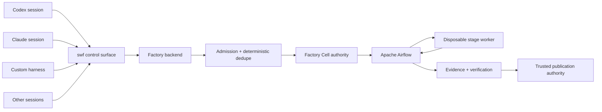

# Multi-Harness Concurrency Methodology

This document extends the [Liquid Software Factory Methodology](liquid-methodology.md) for the case
where many independent AI coding harnesses drive the same software factory and repository at once.

Examples of outer harnesses include Codex, Claude Code, Cursor, Grok, OpenCode, custom agents, CI
bots, and human-operated automation. They may all submit work concurrently, but **none of them
becomes a lifecycle scheduler**.

The governing flow is:



## 1. Session identity is explicit

Every outer harness session uses a stable pair:

```text
(harness, factory_id)
```

Examples:

```text
(codex, codex-session-17)
(claude, claude-session-22)
(custom, worker-03)
```

Reuse the exact same pair when retrying the same outer session. This gives submission dedupe a
stable actor identity without pretending the harness process is the durable identity of the work.

The harness session identifies **who is driving**. The Factory Cell identifies **what durable work
is owned**.

## 2. Work identity and session identity are different

The durable work identity is still the Factory Cell, conceptually:

```text
(repo, target, issue)
```

The session actor can be represented as:

```text
harness:<harness>:<factory_id>
```

Many sessions may safely submit different Cells against one repository. The same Cell, however, has
one current writer authority.

This separation prevents two common mistakes:

1. using a model/harness process as the durable work identity;
2. allowing two independent sessions to mutate the same issue x target Cell concurrently.

## 3. One writer per Cell

For a given issue x target Cell:

- one current epoch owns mutable authority;
- a competing session must be deduplicated, queued, fenced, or refused;
- a stale session from an older epoch may observe but must not mutate current state;
- takeover is explicit and advances the Cell epoch.

The external mutation identity remains:

```text
(cell_id, epoch, operation_key)
```

No outer harness identity overrides epoch fencing.

## 4. Many harnesses may hammer one repository

Repository-wide concurrency is allowed and expected. Safety comes from explicit identities and
bounded admission, not a global mutable checkout lock.

Good:

```text
codex-a  -> issue 101 -> Cell A
claude-b -> issue 102 -> Cell B
custom-c -> issue 103 -> Cell C
```

Each Cell may have independent lifecycle progression while Airflow remains the scheduler.

Bad:

```text
all harnesses -> one shared checkout -> ad-hoc lock files -> direct pushes
```

Shared mutable checkouts make session ownership, cancellation, publication, and cleanup ambiguous.

## 5. Admission is pressure control, not a second scheduler

The admission layer may enforce:

- repository concurrency limits,
- actor/session limits,
- priority,
- fairness,
- queue bounds,
- duplicate submission suppression,
- overload refusal.

Admission decides whether work can enter or must wait. It does not own stage progression. Once work
is admitted, Apache Airflow owns the lifecycle.

A useful distinction is:

```text
admission: may this work enter now?
scheduling: what lifecycle step runs next?
```

Only Airflow answers the second question.

## 6. Deterministic submission dedupe

Retries are normal. A network timeout after submit must not create a second authoritative Cell.

A repeated submission from the same stable session and same work identity should converge on the
same durable intent or be classified explicitly as a duplicate.

Dedupe is not silent data loss. The operator surface should make the existing Cell/run visible so
the caller can continue observing it.

## 7. Epoch takeover and stale sessions

If a session dies, a different session may eventually take over work, but takeover is an authority
transition rather than an informal retry.

Safe takeover sequence:

1. observe durable Cell state;
2. confirm takeover policy permits transfer;
3. advance the Cell epoch;
4. bind the new writer to the new epoch;
5. fence old epoch mutations;
6. observe ambiguous external operations before replay;
7. continue through the Airflow-owned lifecycle.

An old harness reconnecting later must not recover authority merely because it remembers the old
session id.

## 8. Cancellation wins over surviving compute

Outer harness disappearance and worker disappearance are not the same as cancellation.
Cancellation is a durable Cell/lifecycle decision.

If a Cell is cancelled:

- surviving stage workers must not keep making authoritative mutations;
- retries must observe the cancellation before repair;
- a later outer session must not resurrect the Cell accidentally;
- cleanup/reconciliation may continue as control-plane work.

## 9. Outer harness mode vs inner stage mode

An agent can appear in two fundamentally different roles.

### Outer harness

The outer harness:

- submits governed work with `swf`;
- inspects Cells, runs, jobs, gates, and deliveries;
- may answer human-in-the-loop gates only with explicit user authority;
- does not invent stage transitions;
- does not publish directly;
- does not become a scheduler.

### Inner stage agent

An agent launched by Airflow inside a Factory Cell:

- follows the Cell intent/spec/plan;
- stays inside the assigned workspace/sandbox;
- uses only stage-granted tools and credentials;
- returns stage artifacts/results;
- does not schedule future stages;
- does not publish or promote itself.

Confusing these roles is an authority bug.

## 10. Publication remains centralized

Even if an outer harness has its own GitHub credentials, factory-governed work should publish through
the trusted factory publication authority when operating in factory mode.

Why:

- publication can be tied to Cell id and epoch;
- duplicate PR creation can be prevented;
- policy/evidence gates remain authoritative;
- stale sessions cannot bypass current ownership;
- cleanup and delivery verification can reason about one publication path.

## 11. Shared observation surface

Independent harnesses should coordinate through durable factory state, not by messaging each other or
scraping ephemeral worker internals.

The intended shared surfaces are `swf` and the backend, for example:

```sh
swf runs list
swf cells list
swf jobs list
swf attention
swf gates list
swf deliveries list
```

A harness transcript is not authoritative state. A shared terminal buffer is not authoritative state.
Airflow internals should not become an accidental public API for harness coordination.

## 12. Conformance scenarios

Multi-harness behavior should be tested as concurrency invariants rather than only happy-path demos.
Important scenarios include:

- distinct sessions submit distinct Cells concurrently;
- duplicate submission from one session converges deterministically;
- two sessions race for the same Cell;
- stale epoch mutation is refused;
- takeover advances epoch and fences the old writer;
- cancellation beats retry/repair;
- repository admission limits apply under pressure;
- queued work is bounded and observable;
- duplicate external operation keys are detected;
- terminal Cells do not count as active writers;
- publication remains outside stage workers.

Executable conformance support lives in
[`src/swfactory/harness_conformance.py`](../src/swfactory/harness_conformance.py), and the reusable
outer-harness operating contract lives in [`skills/swfactory/SKILL.md`](../skills/swfactory/SKILL.md).

## 13. Operational example

Independent sessions can drive one repository without becoming a distributed scheduler:

```sh
SWF_HARNESS=codex SWF_FACTORY_ID=codex-a swf submit --issue 101
SWF_HARNESS=claude SWF_FACTORY_ID=claude-b swf submit --issue 102
SWF_HARNESS=custom SWF_FACTORY_ID=worker-03 swf submit --issue 103
```

They observe through the same control plane:

```sh
swf cells list
swf runs list
swf attention
```

If two of them submit the same issue x target, the Cell authority contract decides the outcome. The
harnesses do not negotiate ownership themselves.

## 14. Review checklist for harness integrations

- [ ] Does the harness use a stable `(harness, factory_id)` for its session lifetime?
- [ ] Is work identity still the durable issue x target Cell rather than the harness process?
- [ ] Can many sessions submit distinct Cells against one repository?
- [ ] Is the same Cell limited to one current writer/epoch?
- [ ] Are stale epoch mutations fenced?
- [ ] Is duplicate submission deterministic and observable?
- [ ] Does admission remain separate from lifecycle scheduling?
- [ ] Does Airflow remain the only lifecycle scheduler?
- [ ] Are backend/publication/service credentials kept out of inner stage sandboxes?
- [ ] Is publication owned by the factory rather than the harness or stage worker?
- [ ] Can cancellation defeat surviving workers and retries?
- [ ] Can takeover recover from durable state without trusting an old process?
- [ ] Do operators read status from the shared backend/`swf` surface?

## 15. One-sentence rule

**Many harnesses may drive one repository concurrently, but they converge through admission and
Factory Cell authority into one Airflow lifecycle; session identity never replaces Cell identity,
and no harness may bypass epoch fencing, publication authority, or retained evidence.**
