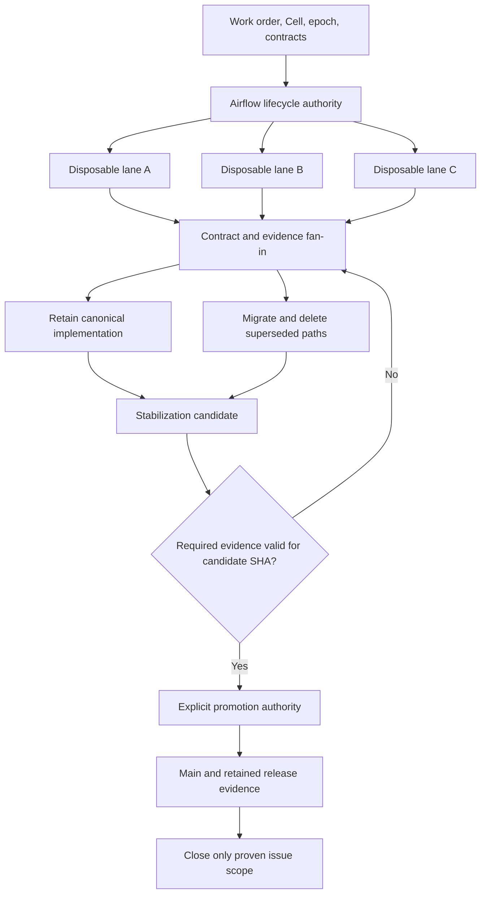

# Liquid Software Factory methodology

**Durable intent. Disposable execution. Singular authority. Deterministic convergence.**

Liquid development deliberately expands implementation alternatives while a problem is being
explored, then removes that freedom at integration. Workers, branches, sandboxes, and candidate
implementations may change shape. Work identity, authority, approved contracts, retained evidence,
and the accepted repository state must remain coherent.

> **Create entropy where exploration benefits from it; destroy entropy before promotion.**

This document is the canonical methodology for two related activities:

- **Product execution:** deliver one work order through an Airflow-managed Factory Cell.
- **Factory development:** turn many issue slices and implementation lanes into one maintained runtime.

The rules below define the intended contract. The [implementation map](#implementation-and-evidence-map)
identifies existing behavior and remaining integration work. A rule, an issue closure, or an emitted
intent is not by itself evidence that an end-to-end guarantee has been achieved.

[Identity and authority](#identity-and-authority) · [Mutation and recovery](#mutation-and-recovery) ·
[Liquid development](#liquid-development) · [CI and promotion](#ci-and-promotion) ·
[Definition of done](#definition-of-done) · [Implementation priorities](#implementation-priorities)

## The core idea

Permit independent lanes to expose assumptions and alternatives. Give each lane a bounded scope,
then compare its result against shared contracts and retained evidence. Integrate one canonical
implementation, migrate its callers, and delete superseded paths before promotion to `main`.

**Parallelism is cheap. Authority is singular.** Many workers may explore; they must not compete to
own scheduling, Cell epochs, external publication, or release decisions. Twenty workers are not
twenty control planes. More issue slices do not require more permanent services or abstractions.

Here, *entropy* means temporary implementation diversity and integration uncertainty. It is a useful
engineering metaphor, not a measured thermodynamic quantity. The
[non-equilibrium control doctrine](non-equilibrium-factory.md) separately requires measurable inputs,
falsifiable behavior, and bounded authority for any physics-inspired control model.

## Identity and authority

### Durable intent, disposable execution

| Disposable or revisable | Durable control-plane record |
| --- | --- |
| Worker processes and agent sessions | Work order and stable Factory Cell identity |
| Sandboxes, VMs, containers, leases | Current epoch, owner, policy, and execution lineage |
| Implementation branches and speculative code | Approved contract and plan revisions |
| Experiments, temporary adapters, intermediate work graphs | Mutation history, checkpoints, recovery decisions, and evidence |
| An individual execution attempt | Airflow lifecycle binding and publication/promotion state |

A worker may disappear without becoming the source of truth. An intermediate plan may change;
the accepted revision and the approvals attached to it must remain identifiable.

### The Factory Cell is the durable unit

A Cell represents **one issue × repository target**. Conceptually it contains or references:

| Field | Meaning |
| --- | --- |
| `cell_id` | Stable identity derived from repository, target, and issue |
| `epoch` | Positive generation of mutation authority |
| Work order and target | Intent, repository, directory/base branch, and relevant commit identities |
| Lifecycle binding | Airflow DAG, run, mapped-job identity, and durable state |
| Policy and plan | Approved contract digests, execution graph, budgets, and limits |
| Mutation history | Operation identities, attempts, observations, and receipts |
| Evidence | Approvals, verification results, provenance, costs, and refusal reasons |
| Publication and cleanup | Delivered artifact, promotion decision, resources, and reconciliation debt |

These are logical responsibilities, not a requirement that every field live in one database row.
The current [Cell store](../src/swfactory/cells.py) uses SQLite; the
[runtime binding](../src/swfactory/cell_runtime.py) identifies a target as `directory@base_branch`.

For example, the following attempts can belong to the same Cell and epoch:

| Cell | Epoch | Compute instance | Outcome |
| --- | --- | --- | --- |
| Cell A | 3 | Sandbox 17 | Crashed |
| Cell A | 3 | Sandbox 18 | Timed out |
| Cell A | 3 | Sandbox 19 | Succeeded |

This is an illustrative recovery sequence, not a recorded benchmark. Replacing compute does not
in itself transfer authority. Explicit takeover or reactivation advances the epoch; recovery must
also determine whether the lost execution state can be reconstructed safely. A recorded sandbox
handle or warm image is not proof that an interrupted workspace can be resumed.

### One authority for each decision

| Decision | Authority | Boundary |
| --- | --- | --- |
| Lifecycle scheduling | Apache Airflow | Ordering, task retries, mapped jobs, waits, and approval pauses |
| Cell ownership | Durable Cell control plane | Current epoch, activation, transfer, and terminal state |
| External mutation | Trusted mutation boundary and journal | Validate owner, policy, operation identity, and observed outcome |
| GitHub publication | Trusted factory SCM boundary | Publish or update the PR and retain its receipt |
| Merge, release, or generation promotion | Explicit human or parent promotion authority | Accept the verified candidate; a worker cannot grant itself authority |

Airflow is the **only managed lifecycle scheduler**. Admission decides whether work may enter;
a provider allocates compute; GitHub Actions validates a candidate. None of these independently
advances the factory's lifecycle. The direct `swfactory run` path is a rehearsal using shared stage
code, not a second durable scheduler to operate beside managed Airflow.

The conceptual lifecycle covers intake, admission, planning, provisioning, execution, verification,
publication, promotion, and cleanup. Those names describe responsibilities; they are not a promise
of one literal DAG task per name. The actual
[blueprint](../blueprints/default.toml) and [DAG](../dags/blueprints.py) define stage order, gates,
metrics, and teardown. Promotion is a separate decision after publication.

### Plan.work stays inside a workstation

`Plan.work` may describe dependencies, parallelizable units, declared outputs, and validations
inside an Airflow-owned stage. It may not persist an independent retry queue, claim lifecycle
ownership, publish directly, or continue authoritative mutations after cancellation.

**Airflow owns the factory. `Plan.work` organizes work at one workstation.**

The current [plan model](../src/swfactory/models.py) bounds the graph to 64 nodes and rejects cycles,
unknown dependencies, duplicate IDs, and undeclared files. Its nodes currently use the `code_writer`
role. `parallel_safe` is a hint; the [default executor](lifecycle.md#forkable-sandboxes-capability-not-fiction)
still runs a governed build/review cell. Do not describe graph validation or a warm-start snapshot
as deployed native-fork execution.

A future parallel executor must inherit the stage's Cell epoch, budget, deadline, policy, and
cancellation, retain fork lineage, and verify the final combined result. Its acceptance question is:
can inner work still mutate authoritatively after the owning lifecycle revokes permission?

## Mutation and recovery

### Epoch fencing and idempotency solve different problems

Identify an external operation conceptually by:

```text
(cell_id, epoch, operation_key)
```

For example, `(cell_842, 4, "publish-pr")` describes a current publication attempt. A returning
worker presenting epoch 3 must be rejected before its side effect. Real keys also need enough scope
to distinguish the logical target and request content; an example label is not a universal key format.

- **Fencing** rejects an owner whose authority has expired.
- **Idempotency** makes repeated attempts at the same authorized operation converge.
- **Observation** resolves whether an external effect occurred when its response was lost.

A read-only operation needs no mutation authority. A write needs current authorization and a safe
retry contract. Idempotency does not make a stale writer authorized. An epoch in a request or log is
not fencing unless the mutation boundary checks it, including the race with authority transfer.

Where a remote API cannot enforce epochs, keep mutation authority behind a controlled publisher,
use the provider's idempotency or conditional-write mechanism where available, and reconcile
ambiguous outcomes from external state. Do not promise exactly-once effects across arbitrary APIs.
If the outcome cannot be established safely, retain `in_doubt` evidence and require deterministic
repair rather than blind replay.

### Recover by observation

For an interrupted mutation:

1. Read durable Cell state, current epoch, policy, and cancellation.
2. Read the operation identity, prior attempts, and any retained receipt.
3. Reject stale authority. If already committed, verify and reuse the recorded outcome.
4. If ambiguous, observe the external resource and compare its identity and content to the request.
5. Classify it as committed, definitely absent, divergent, or still in doubt.
6. Retry only when authorized and safe, within a bounded budget; record the decision and evidence.
7. Let Airflow resume lifecycle progression. Reconcile residual resources separately.

A retry within an epoch preserves its logical operation identity. After an epoch change, reconcile
prior-epoch effects against the same external work before creating a new operation: changing the
key must not create a second PR for an already completed publication.

### Failures are part of the specification

Each domain must state its behavior for the following cases:

| Failure | Required behavior and evidence |
| --- | --- |
| Crash before an effect | Recover intent and classify the operation before retry |
| Crash after an effect, before receipt | Observe the external result; do not infer absence from a missing local success record |
| Timeout or lost response | Retain ambiguity, deadline, and observation history |
| Duplicate request | Converge on the same authorized work or explain the refusal |
| Retry or process restart | Recover durable identity and bounded attempt history |
| Stale worker or resurrected sandbox | Refuse old-epoch mutations; record the refusal |
| Cancellation during execution | Revoke permission to progress; cancellation wins over repair |
| Concurrent claim or takeover | One current owner; explicit, recorded authority transfer |
| Provider outage | Bounded retry/backpressure and visible reason; no independent lifecycle queue |
| Partial cleanup | Retain cleanup debt until resource observation proves reclamation |

A terminal task is not proof that its processes, leases, sandboxes, worktrees, or reservations have
been reclaimed. The current operator stop action changes Airflow state; it is not a universal kill
switch. See [run recovery](run-recovery.md) for current behavior.

## Liquid development

### Seven canonical ownership roles

These roles divide engineering responsibility. They do not imply seven services, seven schedulers,
or the seven product-stage agent names listed in [lifecycle.md](lifecycle.md#the-managed-roles).

| Role | Owns | Required integration output |
| --- | --- | --- |
| `authority` | Cell identity, epoch, ownership, invariants, transfer | One durable authority contract |
| `airflow` | Lifecycle DAGs, mapping, scheduling, approvals, lifecycle recovery | One scheduling path |
| `workgraph` | Decomposition, dependencies, bounded parallel work | Validated work data and deterministic combination |
| `recovery` | Cancel, restart, retry, ambiguous effects, reconciliation | Explicit failure states and repair semantics |
| `security` | Trust boundaries, secret scope, authorization, tenant isolation | Enforced policy and observable refusal |
| `evidence` | Provenance, measurements, logs, traces, benchmarks, claims | Retained proof tied to acceptance criteria |
| `operator` | CLI, TUI, backend API, inspection, repair | Consistent views and explainable actions |

An independent outer harness also has a stable `(harness, factory_id)` session identity. That names
who submits; the Cell names the durable work. Concurrent harnesses coordinate through the factory,
not a shared mutable checkout or private scheduler. See [harness methodology](harness-concurrency-methodology.md).

### Use the domain × concern matrix for coverage

Instead of “implement sandbox lifecycle,” examine that domain through ten concerns. Repeat for
Cell authority, Airflow, workgraphs, evidence, security, operators, and other selected domains.

| Code | Concern | Question every domain must answer |
| --- | --- | --- |
| C01 | Canonical invariant | What must always hold, and who owns it? |
| C02 | Persistence and migration | What survives restart, and how is it migrated or rolled back? |
| C03 | Versioned API | Which stable contract exposes the behavior? |
| C04 | Runtime integration | Where does the Airflow-owned execution path invoke it? |
| C05 | Operator surface | How does someone inspect, explain, or repair it? |
| C06 | Security and policy | What is the trust boundary, secret scope, and refusal behavior? |
| C07 | Recovery and cancellation | What happens on crash, timeout, retry, stale work, and cleanup failure? |
| C08 | Scale and pressure | What are the bounds, fairness rules, and overload behavior? |
| C09 | Evidence and SLOs | What demonstrates correctness, provenance, latency, and cost? |
| C10 | Stabilization and entropy collapse | Which overlapping paths disappear, and what verifies the survivor? |

The axes are explicit in the [bundle engine](../src/swfactory/liquid_bundle_engine.py). A matrix
cell is a completeness question. Several cells may resolve to the same primitive; some may be
inapplicable with a documented reason. It is not a requirement for ten implementations per domain.

### Bound fan-out by integration capacity

Issue count expresses coverage. PR count expresses integration boundaries. They need not match.

Before parallel work starts, each lane needs a contract, owner, file/surface boundary, expected
artifact, validation plan, resource budget, and stopping condition. Split by coherent behavior and
rollback boundary. The historical wave often used five domains × ten concerns per bundle; **10–50
related slices is a planning heuristic**, not a quality target or permission for an unreviewable diff.

A campaign can allocate roughly 20 worker seats: 18 implementation lanes, one CI/CD lane, and one
final integration/closure lane. That describes the staffing pattern, not measured runtime capacity.
Use fewer lanes when shared files, unproven contracts, review capacity, or cost limits demand it.
A difficult problem may explore 12 candidates; a routine edit may need one.

Maximize useful exploration within the available budget, not raw branch or issue count. Stop
opening lanes when unresolved conflicts, duplicate ownership, or stabilization debt exceed the
capacity to converge. Every speculative branch has an owner and a disposition.

### Fan in through contracts; delete superseded paths

1. Compare alternative implementations against the same invariant and acceptance evidence.
2. Identify the common primitive and select or refactor its canonical implementation.
3. Route all relevant issue families and callers through that primitive.
4. Resolve schema/API compatibility and migrate durable state where required.
5. Delete alternate implementations, dead adapters, temporary helpers, and competing authorities.
6. Re-verify the integrated result, including recovery and operator behavior.

C10 is the explicit deletion and integration obligation. Keeping A, B, and C and adding coordinator
D is not convergence. If an old path must remain temporarily, name its owner, compatibility reason,
removal condition, and migration plan.

Legacy vocabulary is absorbed through a documented mapping to canonical Cell, Airflow, workgraph,
persistence, security, evidence, GitHub, deployment, generation, and operator concepts. The
[legacy adapter](../src/swfactory/legacy_issue_runtime.py) records that mapping. Old issue wording
does not require an obsolete implementation family to live forever.

### Stabilize before main

Worker changes converge through bundle PRs into an integration branch such as
`stabilize/liquid-all`. Aggregate validation and deletion happen there. One final PR presents the
candidate for promotion to `main`.



This diagram describes the governing topology. It does not assert that the default product
executor currently launches multiple candidate sandboxes for one issue.

## Historical fan-in and what it proves

[PR #1196](https://github.com/zozo123/ariflow-swfactory/pull/1196) records the original
`stabilize/liquid-all` fan-in. The current [Liquid manifest](../src/swfactory/liquid_release.py)
checks these declared bundles and legacy ranks:

| Wave | Coverage model | Integration units |
| --- | --- | --- |
| Liquid500 | 50 domains × 10 concerns = 500 slices | 10 bundles of 50 |
| Liquid400 | 40 domains × 10 concerns = 400 slices | 8 bundles of 50 |
| Generated total | 90 domains, 900 slices | 18 bundles |
| Legacy backlog | 181 snapshot ranks | Four tranches: 50, 50, 50, 31 |
| Combined original scope | 900 generated slices + 181 legacy ranks | 22 grouped units feeding the final fan-in |

Reproduce the structural check from the repository root:

```sh
uv run python -m swfactory.liquid_release
```

The manifest checks bundle shape, declared source counts, contiguous/non-overlapping spans, and
configured authority names. The bundle engine validates inputs and emits `ExecutionIntent` values.
It does not itself implement every domain effect or prove every acceptance criterion. Legacy ranks
are positions in a snapshot, not a range of GitHub issue numbers.

PR #1196 records head `0603693a99aa675eb5d10592c7a30ebfb8161fda` and merge commit
`22c92ac7951dfe3d1c8f42103192b18b966e1daf`. These identify the historical candidate and merge;
they are not a substitute for retained check results or a claim that current `main` passed them.

Later [PR #2016](https://github.com/zozo123/ariflow-swfactory/pull/2016) records Ocean120,
Phase240, and StatMech360: a further 720 declared slots. Their
[aggregate coverage test](../tests/test_physics_bundle_coverage.py) has the same limitation:
coverage and routing are distinct from integrated, measured runtime capability. The original 900
is a historical wave size, not a claim about the entire current backlog or product feature count.

## Security follows authority

The intended capability flow is Cell intent, policy decision, scoped capability, then disposable
execution. Capabilities should be operation-specific, short-lived, auditable, and revocable where
the provider supports it. A sandbox does not become a permanent credential holder.

Required boundaries:

- Authenticate the actor and authorize the current Cell epoch, target, tenant, and policy revision.
- Grant only the tools and credentials needed by the stage; never inherit backend or publishing
  credentials into coding compute.
- Keep GitHub publication at the trusted SCM boundary and bind it to work identity and evidence.
- Retain policy digests and refusal reasons; stale authority, policy drift, or missing mandatory
  evidence must fail closed.
- Revoke or expire authority on cancellation/transfer and account for cleanup separately.

Current agent/provider integrations may supply model credentials explicitly. “Disposable compute”
does not imply that every capability is already brokered as a short-lived token. Similarly, a
trusted backend token is not a complete multi-tenant authorization system. See
[design](design.md), [backend setup](factory-backend.md), and [security reporting](../SECURITY.md).

## Evidence is part of the product

A delivery claim must identify the subject, conditions, observation, and result. Retain evidence
when the action occurs; do not reconstruct proof from a worker's success message afterward.

| Claim | Minimum evidence to retain |
| --- | --- |
| “This change passed” | Candidate/base identities, exact verification command, fresh result, environment, review, and artifact digests |
| “This retry is safe” | Cell/epoch, operation key, interrupted attempt, external observation, stale-attempt refusal, retry receipt, timestamps, and final state |
| “This operation was authorized” | Actor, scope, target/tenant, policy revision, decision, and mutation identity |
| “This run was cleaned up” | Resource/lease identities, termination observations, unresolved debt, and final reconciliation |
| “This is faster or cheaper” | Workload, baseline, provider/model versions, repetitions, failures, latency distribution, and attributed cost |
| “This candidate may be promoted” | Required checks and their conclusions bound to the exact candidate, evidence digests, and authorized decision |

Sibling forks reusing the same evidence are not independent confirmation. Record lineage and
provenance. A successful DAG run, a published PR, verified code, and a promotable candidate are
separate claims. Missing evidence must remain visible as missing.

The current artifact chain and host journals are described in the
[README](../README.md#what-arrives-with-a-change). The table above is the evidence contract for
stronger claims; it does not imply every listed record is already emitted by every execution path.

## CI and promotion

### Fast exploration, strict convergence

Internal fan-out receives fast feedback; final integration must evaluate the candidate as a whole.
The actual [CI workflow](../.github/workflows/ci.yml) and
[eval workflow](../.github/workflows/evals.yml) currently have these semantics:

| Check | Current trigger and enforcement |
| --- | --- |
| Python lint, format, tests, Liquid manifest, scripted demo | Every PR and pushes to `main`; ordinary failing checks |
| Pinned Airflow parity, smoke, stress | Main-targeted PRs and pushes to `main`; ordinary failing check |
| Upstream Airflow, demo, live scheduler/mapping/approvals | Main-targeted PRs and pushes to `main`; ordinary failing check |
| Rust format, clippy, tests, release build | Main-targeted PRs and pushes to `main`; ordinary failing check |
| Python/Rust fixture contract equivalence | Main-targeted PRs and pushes to `main`; ordinary failing check |
| Pinned live-gate E2E, SRT smoke, Docker smoke, upstream sandbox-toolset | Main-targeted PRs and pushes to `main`; job-level `continue-on-error: true` |
| Scripted eval suite | Selected changed paths, weekly schedule, or manual dispatch; not every final PR |
| Real-agent SRT/islo evaluations | Same eval workflow; actual execution depends on configured secrets |

An ordinary failing check is not automatically a required GitHub branch-protection check. Workflow
configuration alone does not establish repository ruleset enforcement. Advisory failures, skipped
checks, absent secrets, and missing artifacts must not be summarized as full release evidence.

The target promotion standard is to define the mandatory check set for the supported deployment,
make it enforceable, retain its artifacts, and refuse promotion if any mandatory result is failed,
missing, skipped, cancelled, stale, or from the wrong candidate. Exploratory-provider checks may
remain advisory if they are explicitly outside that supported claim.

### Validate and promote the same candidate

1. Freeze the PR head SHA and record the base SHA and tested integration tree where applicable.
2. Run the complete required check set for that candidate and collect retained evidence.
3. Inspect individual conclusions, including advisory and secret-gated jobs; do not infer success
   from a green aggregate badge.
4. Re-read the candidate. If the head changes, invalidate the evidence and rerun. Re-evaluate
   integration when the base changes; a head-only comparison cannot prove compatibility with a new base.
5. Obtain the authorized promotion decision and use a merge operation conditional on the expected
   head SHA, with repository rules enforcing the required integration checks.
6. Record the resulting merge/release identity, evidence, and rollback path. Close only issue scope
   whose acceptance criteria the retained record actually demonstrates.

This is a promotion procedure, not an instruction for a coding worker to merge its own work.
No candidate self-promotes, and documentation of this procedure does not establish automated enforcement.

## Factory-of-factories

The method can extend to candidate factories: generate bounded child generations, evaluate them
against the parent baseline, compare evidence, then explicitly promote one candidate.

Each child needs its own identity, immutable lineage, budget, deadline, isolation, and evaluation
record. Cap generation depth, candidate count, cost, and elapsed time. Children cannot inherit parent
production credentials or install themselves because a score improved. The parent or designated
promotion authority owns adoption and rollback.

[Generation primitives](../src/swfactory/generations.py) define candidate identity, evaluation,
budgets, and promotion predicates. These are foundations for governed experiments, not a claim of
an autonomous production self-improvement loop.

## Definition of done

A slice is complete only when its acceptance criteria are demonstrably true in the surviving
implementation:

- [ ] Canonical invariant and durable owner are explicit.
- [ ] Cell identity, current epoch, authority transfer, and policy boundaries are unambiguous.
- [ ] Runtime entry points reach the intended implementation; a declaration alone is insufficient.
- [ ] External mutations have authorization, operation identity, and safe recovery semantics.
- [ ] Crash, timeout, cancellation, retry, restart, stale worker, duplicate request, provider outage,
      and partial cleanup behavior are specified and validated where applicable.
- [ ] Operator/API views explain state, refusal, and repair from the same contract.
- [ ] Acceptance evidence is retained with provenance, digests, and candidate identity.
- [ ] Meaningful tests or machine validation exercise the claimed behavior.
- [ ] Callers and state are migrated; duplicate implementations are deleted or have an explicit
      temporary compatibility obligation and removal condition.
- [ ] The exact integrated candidate passes the required final checks and receives explicit promotion.
- [ ] The canonical implementation reaches `main`, with the evidence and issue scope linked.

Before promotion, the work may be implemented and reviewable, but it is not closed as delivered.
Neither generated issue coverage nor bulk closure supplies missing behavioral evidence.

## Implementation and evidence map

These links are starting points for review, not blanket capability certification.

| Area | Current surface | What still needs integration or proof |
| --- | --- | --- |
| Identity and epoch | [Cell store](../src/swfactory/cells.py), [job binding](../src/swfactory/cell_runtime.py) | Demonstrate transfer/cancel races across real process and mutation boundaries |
| Managed lifecycle | [DAG](../dags/blueprints.py), [runtime](../src/swfactory/runtime.py), [backend service](../src/swfactory/backend/service.py) | Enforce supported live approval/recovery checks as release evidence |
| Managed publication | [Backend SCM service](../src/swfactory/backend/scm_service.py), [journal](../src/swfactory/idempotency.py) | Converge mutation call sites and test ambiguous remote outcomes end to end |
| Shared capability contract | [Core runtime](../src/swfactory/core_capabilities.py), [focused tests](../tests/test_core_capabilities.py) | The backend currently uses `ControlKernel`; adopt one canonical path without retaining parallel authority |
| Inner work | [Plan model](../src/swfactory/models.py), [workgraph](../src/swfactory/workgraph.py), [lifecycle contract](lifecycle.md) | Wire bounded native fork/merge execution before advertising it |
| Evidence and claims | [Trusted evidence](../src/swfactory/trust_evidence.py), [public capabilities](../src/swfactory/public_capabilities.py) | Link acceptance criteria and claims to retained runtime evidence |
| Matrix and legacy scope | [Bundle engine](../src/swfactory/liquid_bundle_engine.py), [manifest](../src/swfactory/liquid_release.py), [legacy mapping](../src/swfactory/legacy_issue_runtime.py) | Track declared coverage separately from integrated, validated behavior |
| Providers and generations | [Provider conformance](../src/swfactory/provider_conformance.py), [generations](../src/swfactory/generations.py) | Publish measured support boundaries and govern candidate promotion |
| Operators and recovery | [Rust console](../rust/README.md), [recovery guide](run-recovery.md), [backend](factory-backend.md) | Prove cross-surface agreement and repair from durable state after interruption |

## Implementation priorities

The next convergence cycle should focus on a small set of measurable outcomes:

1. Establish a capability-to-evidence inventory and an enforceable promotion gate.
2. Consolidate the live mutation path around one Cell/journal/policy/evidence contract.
3. Prove cancellation, takeover, ambiguous publication, and cleanup through integrated failure scenarios.
4. Complete one bounded `Plan.work` execution path with deterministic combination and provider evidence.
5. Measure useful throughput, recovery, cost, and operator effort; promote control experiments only
   after they improve a retained baseline.

The companion repository improvement issue supplies the ordered implementation bundles, dependencies,
acceptance criteria, and deletion obligations. Use this methodology as its contract, and update the
status/evidence map as each capability becomes demonstrable.

When implementation and documentation disagree, record and repair the discrepancy. Preserve singular
authority while resolving it; do not add another scheduler or control plane to make both descriptions true.
