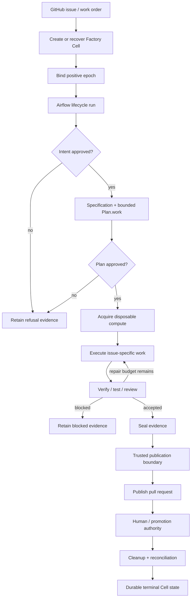

# Liquid Software Factory Methodology

This document is the development and execution constitution for the Airflow Software Factory.
It explains the methodology used to turn a large, high-entropy backlog into one coherent runtime
without creating a second scheduler, duplicate control planes, or unverifiable claims.

The short version is:

> **Fan out ideas aggressively. Fan in contracts deterministically. Keep authority singular. Keep
> compute disposable. Keep identity durable. Fence mutations. Require evidence. Delete superseded
> abstractions.**

The methodology applies at two levels:

1. **Product execution** - how one GitHub issue moves through the software factory.
2. **Factory development** - how many implementation issues and parallel workers can change the
   factory itself without turning the repository into competing architectures.

The second level is what we call **Liquid Development**.

---

## 1. The constitution

These rules are deliberately stronger than ordinary implementation preferences. New work should
fit them or explicitly change the architecture first.

### Rule 1: Apache Airflow is the only lifecycle scheduler

Airflow owns lifecycle scheduling: task ordering, retries, mapped jobs, waits, approval pauses,
timeouts, and the durable progression of a factory run.

Inner issue work may contain a bounded work graph (`Plan.work`), but that graph is data executed
inside an Airflow-owned stage. It is **not another scheduler**.

Why: two schedulers create ambiguous ownership for retries, cancellation, backpressure, and
recovery.

### Rule 2: the Factory Cell is the durable unit of ownership

A **Factory Cell** is the durable boundary for one issue x target identity, state, policy, and
evidence. A sandbox, process, container, or MicroVM is only an incarnation of that Cell.

Compute may disappear. Cell identity must not.

A worker that restarts must recover from durable Cell intent rather than treating a surviving
process as the source of truth.

### Rule 3: every mutable authority is epoch-fenced

A Cell has a positive epoch. Takeover, reactivation, or authority transfer advances the epoch.
External mutations are identified by the tuple:

```text
(cell_id, epoch, operation_key)
```

A stale worker from an older epoch must not be able to mutate current state.

An external operation must therefore be one of:

- idempotent under its operation key,
- fenced by the current Cell epoch,
- or explicitly read-only.

### Rule 4: compute is disposable; intent and evidence are durable

Sandboxes are hands, not brains. They may be created, replaced, reclaimed, or lost.

Durable state belongs to the control plane: Cell identity, epoch, plan, approvals, operation
journal, evidence, publication state, and recovery decisions.

### Rule 5: authority must be singular

There should be exactly one authority for each of these decisions:

| Decision | Authority |
| --- | --- |
| Lifecycle scheduling | Apache Airflow |
| Cell ownership and current epoch | Cell control plane |
| External mutation identity | `(cell_id, epoch, operation_key)` journal |
| GitHub publication | trusted publication boundary |
| Release/promotion | explicit promotion authority |

Duplicating an authority is architecture debt, even if both implementations currently agree.

### Rule 6: evidence is required for claims

Success, security, performance, recovery, compatibility, and cost claims must be backed by retained
evidence. If the evidence required for a claim is missing, the system should refuse to assert it.

This is why evidence is a runtime concern rather than documentation added at the end.

### Rule 7: fail closed at trust boundaries

Policy uncertainty, stale authority, missing evidence, invalid epoch, or ambiguous publication
identity should stop or refuse the operation rather than silently continue.

### Rule 8: backpressure is not scheduling

Admission control, quotas, fairness, throttling, and resource pressure may delay or reject work,
but they must not become a hidden second scheduler. Airflow still owns lifecycle progression.

### Rule 9: factories may create candidate factories, never self-promote implicitly

A factory-of-factories is allowed only when it is bounded and generational:

- parent and child generations have distinct identity,
- child experiments are isolated,
- evaluation is explicit,
- promotion is explicit,
- a child cannot make itself authoritative merely because it produced a better result.

### Rule 10: stabilization deletes entropy

Parallel development is allowed to create temporary duplication. Final fan-in is not complete until
superseded abstractions, branches, adapters, and alternate authorities are removed or intentionally
retained with a documented reason.

---

## 2. Product execution flow

One issue does not become one long-lived worker. It becomes durable Cell intent scheduled by
Airflow and executed through replaceable compute.



The important distinction is between **lifecycle state** and **compute state**. Losing a sandbox is
a recoverable runtime event. Losing Cell identity or mutation history is a control-plane failure.

---

## 3. `Plan.work`: bounded inner graphs, not nested orchestration

Issue-specific work often has dependencies: edit A before B, run two analyses in parallel, then
combine them. The plan may describe that as a DAG-like graph.

That graph must remain:

- bounded by the current Airflow stage,
- issue-specific,
- validated before execution,
- subordinate to Cell policy, epoch, timeout, budget, and cancellation,
- unable to create an independent lifecycle authority.

A useful test is:

> If Airflow cancels the owning stage, can the inner work continue to make authoritative external
> mutations?

If the answer is yes, the design has accidentally created a second scheduler.

---

## 4. Liquid Development

Liquid Development is the repository-development method for safely using many workers against a
large backlog.

It intentionally separates **entropy creation** from **entropy collapse**.

### Phase A: expand the problem space

Create a broad issue matrix so missing dimensions are visible. The repository used two recurring
axes:

1. **Domain** - the architectural area being changed.
2. **Concern** - the type of completeness required for that domain.

The canonical concern set is implemented by `Concern` in
[`src/swfactory/liquid_bundle_engine.py`](../src/swfactory/liquid_bundle_engine.py):

| Code | Concern | Required question |
| --- | --- | --- |
| C01 | Invariant | What identity/ownership rule must always hold? |
| C02 | Persistence | How is it durable, migrated, and rolled back? |
| C03 | API | What stable/versioned contract exposes it? |
| C04 | Runtime | How does Airflow-owned execution invoke it? |
| C05 | Operator | How can an operator inspect or repair it? |
| C06 | Security | What policy/trust boundary applies? |
| C07 | Recovery | What happens on cancel, crash, retry, stale writer, restart? |
| C08 | Scale | What happens under load, fairness, quotas, and backpressure? |
| C09 | Evidence | What proves success, refusal, latency, provenance, and cost? |
| C10 | Stabilize | What duplicate or superseded abstraction gets deleted? |

This matrix is not a promise to build ten separate systems. It is a checklist forcing every domain
to be viewed from ten completeness angles.

### Phase B: fan out implementation lanes

Parallel workers take disjoint slices. The preferred worker roles are:

| Role | Primary responsibility |
| --- | --- |
| `authority` | Cell identity, ownership, epoch, transfer, generations |
| `airflow` | lifecycle binding, mapped execution, waits, scheduler parity |
| `workgraph` | bounded inner work, sandbox execution, deterministic dependencies |
| `recovery` | mutation observation, journal, reconciliation, cleanup, restart |
| `security` | policy, trust zones, secrets, tenant boundaries, fail-closed behavior |
| `evidence` | evidence ledger, provenance, metrics, SLO/cost records |
| `operator` | backend/CLI/TUI inspection, repair, release/operator UX |

Roles are ownership lanes, not separate architectures. Every lane routes back to the same canonical
authorities.

### Phase C: implement coarse bundles, not one PR per issue

A generated backlog can easily produce hundreds of tiny PRs whose merge order becomes the actual
architecture. Liquid Development avoids that by grouping related issues into bounded bundles.

For generated matrix work, a standard bundle is:

```text
5 domains x 10 concerns = 50 issues
```

For irregular legacy work, a tranche may contain **10 to 50 issues**.

The bundle boundary is large enough to implement a coherent surface and small enough to review,
retry, or replace independently.

The executable bundle contract lives in
[`src/swfactory/liquid_bundle_engine.py`](../src/swfactory/liquid_bundle_engine.py).

### Phase D: fan in through contracts

Workers do not merge by choosing a winner ad hoc. Fan-in means mapping each implementation back to
canonical contracts:

- one scheduler,
- one Cell identity model,
- one epoch/fencing model,
- one mutation journal model,
- one publication authority,
- one evidence vocabulary,
- one promotion path.

Legacy issue vocabulary is mapped through
[`src/swfactory/legacy_issue_runtime.py`](../src/swfactory/legacy_issue_runtime.py) rather than
preserving old one-off runtimes.

### Phase E: stabilize and delete

The fan-in branch is where temporary entropy is removed:

1. run formatting/lint,
2. run unit and integration tests,
3. run Airflow parity and live scheduler checks,
4. run sandbox smoke paths,
5. run Rust fmt/clippy/tests/release build,
6. run contract equivalence,
7. run evals,
8. remove temporary formatter/worker helpers,
9. delete or fold duplicate abstractions,
10. merge to `main` only from an exact known head SHA.

This is deterministic fan-in: the exact candidate that passed the gate is the exact candidate that
is merged.

---

## 5. Why the bundle engine emits intents

The Liquid bundle engine does not execute its own scheduler. It validates domain/Cell invariants and
emits an `ExecutionIntent` routed to an existing authority.

Representative mapping:

```text
C01 invariant   -> assert invariant
C02 persistence -> persist
C03 API         -> expose versioned API
C04 runtime     -> dispatch from Airflow
C05 operator    -> inspect or repair
C06 security    -> authorize or refuse
C07 recovery    -> recover or cancel
C08 scale       -> measure / throttle under pressure
C09 evidence    -> measure and seal or refuse
C10 stabilize   -> stabilize and delete superseded
```

This is an anti-duplication device. A new issue may add a domain, but it should not invent another
scheduler, another Cell ownership model, or another publication authority.

---

## 6. Recovery semantics

Recovery starts from durable truth and observation, not wishful replay.

For an interrupted external mutation:

1. load the current Cell and epoch,
2. reject stale epochs,
3. load the operation key and prior journal state,
4. observe the external system when the previous outcome is ambiguous,
5. classify the operation as already applied, safely retryable, failed, or requiring repair,
6. record the resolution,
7. continue only through the Airflow-owned lifecycle.

Cancellation has priority over repair. If durable Cell state says the work is cancelled, recovery
must not resurrect it because a worker happens to still be alive.

Cleanup is also a durable concern. A terminal Airflow task does not prove that all sandboxes,
leases, worktrees, or external reservations were reclaimed. Reconciliation must be able to find and
repair cleanup debt later.

---

## 7. Security model

The methodology separates capability from authority.

A coding sandbox may have the capability to edit files or run tests, but it should not receive the
credential that grants publication authority. The control plane decides which tools and credentials
are present for each stage.

Security rules:

- least privilege by stage,
- no implicit secret inheritance into disposable compute,
- policy version visible at decision time,
- tenant/repository boundaries explicit,
- stale epochs fail closed,
- missing evidence fails closed for evidence-backed claims,
- backend/operator credentials are not silently replaced with local fallbacks.

---

## 8. Evidence as a control-plane primitive

Evidence should answer both **what happened** and **why the system was allowed to say it happened**.

Useful evidence classes include:

- intent/specification digests,
- approval actor, time, and artifact digest,
- plan/work graph revision,
- Cell id and epoch,
- operation journal records,
- sandbox/provider identity and capabilities,
- verification commands and fresh results,
- review findings and repair rounds,
- provenance/SBOM data where relevant,
- stage latency and cost,
- refusal and cancellation reasons,
- publication identity and target.

A benchmark without retained inputs/environment/result evidence is not a benchmark claim. A security
claim without the policy/version/decision evidence is not a security claim. A successful workflow
run without delivery verification is not proof that delivered code is correct.

---

## 9. Publication and promotion

Publication and promotion are intentionally separate.

**Publication** creates an external artifact such as a pull request using trusted SCM authority.

**Promotion** decides that the artifact becomes authoritative: merge, release, deployment, or parent
factory promotion.

A coding worker may propose. It does not self-promote.

This distinction also applies to generated factories: a child factory can emit evidence that it is
better, but only the parent/promotion authority can adopt it.

---

## 10. Exact-head fan-in

Parallel branches move quickly, so "CI was green recently" is not enough. Final fan-in uses an
exact-head discipline:

```text
candidate SHA -> run complete gate -> verify PR head is unchanged -> merge with expected_head_sha
```

If the head changes after the gate, the prior result is stale and the new head must be evaluated.

This prevents accidental merging of an untested formatter patch, late worker commit, or conflict
resolution.

---

## 11. CI topology for high fan-out

Running the full expensive matrix on every internal fan-out PR wastes capacity and encourages people
to bypass CI. The repository therefore separates fast internal feedback from final-main evidence.

Conceptually:

```text
internal fan-out PR
    -> fast Python gate

fan-in PR to main
    -> full Python tests
    -> Airflow parity
    -> sandbox smoke paths
    -> upstream/live Airflow checks
    -> Rust fmt/clippy/tests/release
    -> cross-language contract equivalence
    -> evals

push to main
    -> repeat the production-relevant gate
```

The final-main gate is the release-quality proof. Internal fan-out remains cheap enough to stay
parallel.

---

## 12. Legacy collapse

Old backlogs often encode the same architecture under different names. Treating every historical
term as permanent creates layers forever.

Legacy work is normalized into ten broad areas:

- Cell control plane,
- Airflow lifecycle,
- operator surfaces,
- workgraph/sandbox,
- persistence/reconciliation,
- security/policy,
- evidence/observability,
- GitHub intake/publication,
- deployment/supply chain,
- factory generations.

Those areas are adapters into canonical anchors, not new authorities. The adapter is implemented in
[`src/swfactory/legacy_issue_runtime.py`](../src/swfactory/legacy_issue_runtime.py).

The goal of legacy closure is therefore **semantic collapse**, not merely marking issue numbers
closed.

---

## 13. Anti-patterns

Reject these designs unless the architecture is deliberately being changed:

### Hidden scheduler

A worker queue or inner DAG independently retries, cancels, or advances lifecycle state after the
owning Airflow task is gone.

### Process identity as ownership

A PID, container ID, sandbox ID, or VM ID is treated as the durable identity of the work.

### Retry without observation

An ambiguous external mutation is blindly replayed without checking whether it already happened.

### Stale writer wins

An old worker can still publish or mutate because the external API did not receive the Cell epoch.

### Evidence after the fact

The system claims success/security/performance first and tries to reconstruct evidence later.

### Parallel PRs as permanent architecture

Two workers create overlapping schedulers/stores/policy engines and both are retained because each
PR was locally reasonable.

### Self-promotion

A child factory, worker, or model decides that its own output is authoritative without an explicit
promotion authority.

### Stabilization by accumulation

A new abstraction wraps the old abstraction, which wrapped an older abstraction, without deleting
or migrating anything.

---

## 14. Review checklist

Before accepting a new architectural slice, ask:

- [ ] Is Airflow still the only lifecycle scheduler?
- [ ] What is the durable Factory Cell identity?
- [ ] What is the current positive epoch?
- [ ] Which external mutations exist, and what are their operation keys?
- [ ] Are mutations idempotent, epoch-fenced, or read-only?
- [ ] Can cancellation win over a surviving worker?
- [ ] Can a lost sandbox be replaced from durable intent?
- [ ] Is backpressure only admission/throttling rather than hidden scheduling?
- [ ] Where is policy evaluated, and does uncertainty fail closed?
- [ ] What evidence is retained for the claims made by this slice?
- [ ] Are CLI/TUI/backend views derived from the same contract?
- [ ] Is publication authority separated from coding capability?
- [ ] Is promotion explicit?
- [ ] What old abstraction is deleted or migrated during stabilization?
- [ ] Will final CI run on the exact SHA that is merged?

---

## 15. Code map

The methodology is reflected in code rather than existing only as prose.

| Methodology area | Canonical implementation surface |
| --- | --- |
| Concern matrix and intent routing | `src/swfactory/liquid_bundle_engine.py` |
| Generated bundle registrations | `src/swfactory/liquid_bundle_*.py` |
| Legacy normalization | `src/swfactory/legacy_issue_runtime.py`, `src/swfactory/legacy_tranche_*.py` |
| Cell authority | `src/swfactory/liquid_authority_runtime.py` and core Cell/runtime modules |
| Airflow ownership | `src/swfactory/liquid_airflow_runtime.py`, `dags/`, scheduler integration |
| Work graph | `src/swfactory/liquid_workgraph_runtime.py`, plan/runtime modules |
| Recovery/reconciliation | `src/swfactory/liquid_recovery_runtime.py`, journals/recovery modules |
| Security | `src/swfactory/liquid_security_runtime.py`, policy/tool boundaries |
| Evidence | `src/swfactory/liquid_evidence_runtime.py`, factory evidence artifacts |
| Operator surface | `src/swfactory/liquid_operator_runtime.py`, backend and Rust CLI/TUI |
| CI fan-in | `.github/workflows/ci.yml`, `.github/workflows/evals.yml` |

The `liquid_*` modules are consolidation surfaces: they encode the common contract used to collapse a
large backlog. Product behavior still lives in the normal runtime, Airflow, backend, sandbox, SCM,
and operator modules referenced throughout the design documentation.

---

## 16. Relationship to the rest of the documentation

Read this document as the **methodology/constitution**. Then use the specialized documents for
implementation detail:

- [`design.md`](design.md) - architecture and trust-boundary design.
- [`lifecycle.md`](lifecycle.md) - managed lifecycle and fork semantics.
- [`run-recovery.md`](run-recovery.md) - interrupted-run recovery.
- [`factory-backend.md`](factory-backend.md) - backend/operator boundary.
- [`swf.md`](swf.md) - Rust CLI/TUI operator surface.
- [`evals.md`](evals.md) - evaluation strategy.
- [`../OPERATIONS.md`](../OPERATIONS.md) - deployment and real-repository operation.

When these documents appear to conflict, first preserve the singular-authority rules in this
methodology and then reconcile the implementation/design docs explicitly. Do not solve a conflict by
silently introducing a second authority.

---

## 17. The methodology in one sentence

**Create parallel entropy only inside bounded lanes; collapse it through one Airflow lifecycle, one
durable Cell/epoch authority, fenced external mutations, retained evidence, explicit promotion, and
the deletion of superseded implementations before `main`.**
