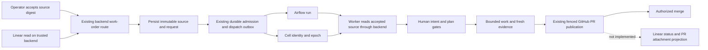

# Native Linear work orders

The backend can admit one explicitly selected Linear issue through the existing durable
admission and Airflow dispatch path. It retains accepted source text and serves it to workers
through the current Cell epoch. This is a maintenance implementation of the
[intake design in PR2361](https://github.com/zozo123/ariflow-swfactory/pull/2361) with local
behavior tests. It is not a deployment qualification or a successful managed product run.

## Configure a reviewed manual blueprint

Add the following table to a manual blueprint that already declares human gates after
`intent` and `plan`. Use real immutable organization and project UUIDs in the installed file.
The new section is deliberately unknown to older workers, which refuse blueprint loading.

```toml
[work_source]
kind = "linear"
workspace_id = "<workspace-uuid>"
project_id = "<project-uuid>"
```

The blueprint must not have a cron trigger, fixed issue list, or GitHub backlog selector. Its
selected target repositories must match the trusted backend's configured publication repository,
`SWF_REPO`. The usual target contract, budgets, sandbox confinement, evidence and promotion
requirements still apply. A blueprint can have multiple target directories in that repository.

The backend needs `SWF_LINEAR_API_KEY`. The operator submitting work needs the existing
`SWF_BACKEND_URL` and `SWF_BACKEND_TOKEN`. Worker hosts need the existing managed callback
configuration and `SWF_SCM=github` so publication uses the backend proxy. Linear and GitHub
service credentials must remain outside stage sandboxes. No credential appears in source
snapshots, work-order requests, Airflow run configuration, or XCom.

## Preview

`linear-preview` reads one issue on a trusted controller and prints a JSON preview:

```bash
uv run swfactory linear-preview <issue-uuid> \
  --workspace-id <workspace-uuid> --project-id <project-uuid>
```

It needs the immutable issue UUID and the expected workspace and project UUIDs. The workspace ID is
Linear's organization UUID; a team UUID or URL slug cannot substitute for it. The title and
description are preserved exactly, and mismatched identities are refused. `SWF_LINEAR_API_KEY`, a
Linear personal API key (see Linear's
[GraphQL authentication and errors](https://linear.app/developers/graphql)), comes from the
controller's secret configuration, never from the command, issue text, a work cell or a worker
bundle. A missing key is refused before network I/O.

The source key is `linear:<workspace UUID>:<issue UUID>`; display identifiers and URLs do not
determine identity. The intent digest covers that key, the project and team UUIDs and the original
title and description. A status, identifier, URL or `updatedAt` change keeps the digest; a title or
description edit changes it, including an appended PR link, so status projection must use Linear
attachments rather than edit accepted text. The digest identifies the preview text only. It is not
the work-order key or an accepted-input receipt, and every preview says `admission_ready: false`,
because only the backend can resolve eligibility and reserve a Cell.

The client makes one bounded GraphQL read, refuses redirects and does not retry. Partial GraphQL
errors, oversized or malformed responses, unknown workflow states and missing required fields
refuse the read, and error messages never echo server text. Known credential patterns and a
response containing the controller key are rejected. That check cannot detect every secret in free
text, so a preview must not be passed directly to a work cell.

## Submit the accepted revision

```bash
uv run swfactory linear-submit <issue-uuid> \
  --line <installed-blueprint> --intent-digest sha256:<accepted-digest>
```

`linear-submit` posts the following contract to the existing `POST /v1/work-orders` route.
It does not call Airflow directly. Do not mix this request with legacy `issues` or
`airflow_run_id` fields.

```json
{
  "line": "installed-blueprint",
  "work_source": {
    "schema_version": 1,
    "kind": "linear",
    "issue_id": "<issue-uuid>",
    "intent_digest": "sha256:<accepted-digest>",
    "attempt": "initial"
  }
}
```

Admission rechecks the configured workspace, project, canonical issue identity, terminal or
archived state, and incoming dependency relations. It refuses a changed intent digest before
Cell activation. This first route accepts only work without incoming `blocks` relations. It
refuses every such dependency, even if Linear calls it Done, because verified delivery receipts
for dependencies are not implemented. Missing or truncated relation data also refuses admission.

## Execution and recovery



The execution key includes the immutable workspace and issue UUIDs, accepted intent digest,
stable attempt, target jobs and complete resolved blueprint identity. Delivery IDs, display
identifiers, statuses and Cell epochs do not create another execution. The first persisted
snapshot wins if duplicate deliveries race. An existing receipt is recovered before any mutable
Linear read, so a lost response or controller restart cannot silently accept edited text.

Repeating a terminal work order returns its terminal receipt. It does not rearm the Cell. To
request another attempt deliberately, use a new stable `--attempt` value and reuse that value
on every retry. Changed intent needs a freshly accepted digest and fresh human decisions. A
live Cell cannot be replaced by another attempt; finish or cancel it through the existing
operations layer first. A refused attempt is not automatically retried as a new execution.

The existing operation journal observes an uncertain Airflow outcome before redelivery. The
admission outbox retains capacity and dispatch state across restarts. No new scheduler, poller,
queue database, or background loop is introduced.

Each worker source read verifies current Cell epoch, policy, issue identity, authoritative
Airflow binding and the full blueprint digest against the retained work order. It then checks
the snapshot digest and passes the retained issue to the existing accepted-input fence. It
does not reread Linear. Missing or corrupt snapshots and mismatched worker blueprints refuse
the task. GitHub issue creation is refused for native Linear Cells. The existing PR body includes
the retained Linear URL.

## What remains

Native dependency receipt verification, Linear status and PR attachment projection, maintenance
incident creation in Linear, and webhook authentication/deduplication are not implemented.
The operator must explicitly invoke the route. Do not run the existing GitHub-issue maintenance
path as a workaround for Linear work. Linear Done never authorizes promotion or proves delivery.

A qualified deployment still needs an installed source-enabled product blueprint, controller
credentials, matching backend and worker versions, provider and sandbox qualification, managed
callback wiring, effective promotion protection, fresh candidate evidence and human gate
decisions. No deployment credentials or live policy are changed by this patch. Do not roll a
controller back to a version without native source support while native work orders are pending.

## Tests

`tests/test_linear_source.py` drives the real parser and CLI through an injected HTTP transport:
immutable text, UUID identity across JSON reloads, intent edits versus status-only changes,
malformed or unauthorized source data, partial GraphQL success, credential rejection, bounded
responses, API errors and no admission in the CLI output. It requires one GraphQL query and no
mutation.

`tests/test_native_linear_intake.py` exercises the canonical CLI through a real loopback backend
HTTP server, with fake Linear and Airflow transports. It checks duplicate submissions, concurrent
delivery, lost client and Airflow responses, backend restart, queued capacity release, terminal
replay, explicit reattempts, source edits, epoch/policy/blueprint fences, corrupt snapshots and
worker context creation without a Linear key. It asserts one remote Airflow run per execution
and rejects GitHub issue calls. Source transport tests check terminal states, complete relation
reads and dependency refusal.

These are real backend, SQLite, runtime and boundary tests with controlled external transports.
They are not evidence of a live Linear token, a paid provider call, a running Airflow deployment,
a published PR, status reconciliation or an authorized merge.
