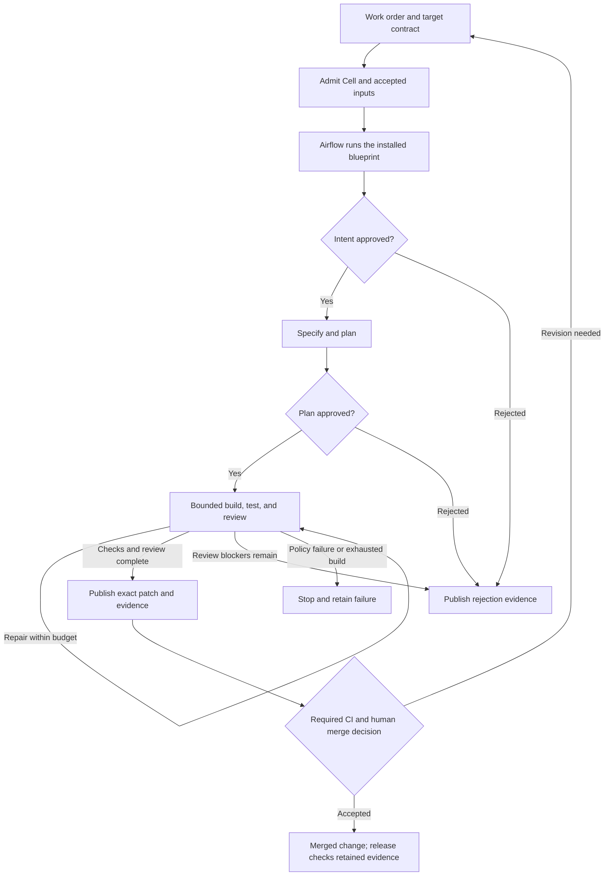

# Software Atelier: flow, concepts, and finish line

**Turn an accepted work order into a reviewable change whose evidence and authority survive the
workers that produced it.** Creative search is useful only when it improves that outcome.

This is the navigation map for the repository. The [runtime ownership map](runtime-ownership-map.md)
names owners; the [capability inventory](../config/capability-inventory.json) names support levels and
graduation work; [promotion policy](promotion-policy.md) defines acceptance. This document does not
create a second policy, scheduler, or capability registry.

## The flow that runs today



Metrics and teardown accompany the route. Cleanup failures remain recovery debt. Publishing a PR,
completing an Airflow run, merging, and shipping a release are separate events with separate evidence.
The rejection path publishes a labeled, blocked evidence PR; it does not approve the change.

| Atelier step | Current runtime | Evidence or boundary |
| --- | --- | --- |
| Commission | Backend admission, accepted inputs, `intent`, human gate | Work identity, pinned inputs, approved intent digest |
| Sketch | `spec`, `plan`, human gate, `work_stage.build_and_test` | Typed plan, approved plan digest, bounded attempts and test receipts |
| Critique | `review`, including bounded repair | Findings and verdict; reviewer approval is not merge authority |
| Freeze and verify | Workspace-head checks, patch validation; [candidate](candidate-evidence.md) and CI evidence paths | Exact source/base/tested identity and retained artifact digests; no single universal claim certificate yet |
| Steward | Trusted publication, repository checks, human merge decision | Publication identity and applicable repository policy |
| Learn and recover | Metrics, operation journals, recovery paths, `swfactory improve` | Observations and proposals; no automatic self-authorization |

The installed blueprint supplies the actual stage order and gate modes. The default line has human
intent and plan gates. Scripted replay is an explicitly different execution environment, not proof
that a live deployment works. Read [lifecycle](lifecycle.md), [design](design.md), and
[the atelier method](software-atelier.md) for the detailed contracts.

## The objects and their meanings

| Notion | Concrete meaning | Must not be confused with |
| --- | --- | --- |
| Work order / commission | Requested outcome for an issue and selected target | An automatically complete specification |
| Blueprint | Installed, versioned route with stages, gates, limits, and adapters | A new scheduler generated for every issue |
| Target contract | `factory.toml`: verification commands, source/tests, protected paths | Permission to rewrite verification during repair |
| Cell | Durable identity of managed work | A VM, process, model session, or branch |
| Epoch | Fencing generation of a Cell's authority | Retry count or age of a sandbox |
| Operation key / journal | Stable effect identity and its observed outcome | Blindly retrying an ambiguous external write |
| Accepted inputs | Pinned work, plan/policy inputs, and their identities | Whatever a worker happens to read on restart |
| Candidate | Exact proposed source revision with parentage | The mutable branch name that currently points at it |
| Snapshot / recipe | Reproducible source plus the declared procedure/environment | Proof that a provider can fork a running process |
| Evidence / receipt | Retained result bound to the object and procedure measured | A green badge, confidence score, or authorization |
| Claim / uncertainty | A scoped assertion, assumptions, method, result, and unknowns | One global percentage of correctness |
| Approval / promotion | Authorized decision about identified inputs or candidate | Search selection or reviewer preference |
| Capability claim | Declared support with runtime entry, tests, and graduation requirements | Candidate-specific execution evidence |
| Recovery debt | An unresolved operation or resource needing reconciliation | Work that disappeared because a task ended |

## Where the ideas belong

Keep the vocabulary subordinate to these responsibilities. A new metaphor does not require a new
service, state machine, command family, or storage system.

| Idea | Useful role | Current boundary / reference |
| --- | --- | --- |
| Atelier | Human intent, alternatives, critique, and judgment | Product method; [software atelier](software-atelier.md) |
| Liquid | Explore broadly, then converge on one exact candidate | Engineering method; [Liquid methodology](liquid-methodology.md) |
| Gas / liquid / critical / crystal / glass / jammed | Classify measured search and resource conditions | Experimental search-only contract; [phase control](phase-control.md) |
| System 1 and System 2 | Distinguish proposal generation from measurement | Vocabulary only; [future factory](future-factory.md) |
| Swarms / recursive search | Allocate bounded compute using diversity, correlation, disagreement, and retained results | Experimental population path; [future factory](future-factory.md) |
| Annealing | Repair material defects under limits | [Liquid review](liquid-annealing.md); never erase failed evidence |
| Formal claims / crystallization | Decide what can be stated and which verification method fits | A TLA+ model of the authority kernel; no runtime contract or refinement yet; [formal correctness](formal-correctness.md) |
| Memory / blackboard | Retain lineage and observations for later search | Search evidence; a repeated belief cannot become permission |
| Caches / Turbo / snapshots | Avoid repeated computation | Acceleration within the same verification contract |
| Self-improvement | Propose a bounded change against measured debt | Ordinary reviewed work, with the current policy still in force |

The default managed build uses one governed workspace. The optional population path can execute
provider-bound search tasks and retain their results inside that build stage. This does not imply
provider-native source forks, default multi-candidate delivery, calibrated adaptive thresholds, or
qualified support for every model/provider combination.

## Current ownership and the Rust destination

| Responsibility | Current implementation | Migration destination |
| --- | --- | --- |
| Lifecycle scheduling | Airflow | Airflow |
| Managed application state, stages, mutation/recovery, and publication | Python backend and application modules | Proposed Rust manager, one verified use case at a time |
| Operator CLI/TUI | Rust `swf` over backend APIs | Rust `swf` over the manager API |
| Pure cross-language contracts | Python and Rust fixtures/domain implementations | Preserve equivalence while moving ownership |
| Search experiments | Primarily Python, bounded by the managed path | Remain replaceable; never acquire promotion authority |

`authority.py`, `control_kernel.py`, `core_capabilities.py`, and `backend/` describe the current
Python authority implementation. A Rust protocol or domain type is not evidence that the deployed
mutation path calls a Rust manager. The [Rust manager RFC](rfc-rust-first-factory-manager.md)
describes the intended destination and its migration rule.

For each migration: freeze the external contract, implement the use case, check shared fixtures
and failure/recovery behavior, switch the managed caller, then remove the old owner. Keep persisted
records readable and rollback explicit. Do not keep two authoritative writers to ease the transition.

## A finish line that can be demonstrated

Completion belongs to a declared release scope and environment. These are acceptance milestones,
not a claim that the repository already satisfies them or a request to enable everything at once.

| Order | Milestone | Evidence that closes it |
| --- | --- | --- |
| 1 | Enforce the existing promotion boundary | No live drift from `.github/promotion-policy.yml`; required aggregate checks, review policy, and intended admin enforcement active. Tracked by [#2048](https://github.com/zozo123/ariflow-swfactory/issues/2048). |
| 2 | Demonstrate one complete managed delivery | A real commission reaches a reviewed PR and human merge with input, candidate, approval, test, review, publication, and cleanup records retained; repeat across process replacement. |
| 3 | Join claim-level evidence to that delivery | One inspectable record links the accepted commission, exact candidate, scoped claims, methods, assumptions, residual uncertainty, and existing authority decision. Tampering or stale identity invalidates the affected claim. |
| 4 | Qualify each advertised live execution path | Retained runs cover isolation, credential boundaries, cancellation, ambiguous effects, restart, and teardown for the specific provider/environment. Graduate only that scope. |
| 5 | Earn adaptive search | Compare against a fixed-budget baseline on held-out work. Retain lineage, correlation, cost, time, and verifier outcomes; calibrate thresholds from results. |
| 6 | Establish formal refinement where justified | Check the formal model, project trusted runtime traces into its actions, and bind the refinement receipt to the claim. State model assumptions and unproved boundaries. |
| 7 | Complete each Rust migration slice | The managed path calls the Rust owner, parity and recovery evidence pass, and the displaced Python authority is removed. |

Milestones 5–7 can proceed separately after their prerequisites are demonstrated. A supported first
release need not wait for every research direction. Explicitly exclude unqualified features from
its support promise and keep their inventory entries experimental.

Measure accepted, independently verified changes against wall time, actual spend, and human review
effort. Keep correctness and authority as hard constraints. Also track counterexamples, recovery
debt, cleanup failures, and reproducibility. Raw agent count, issue closures, import reachability,
and a higher self-reported score do not establish useful progress.

## Use the existing improvement loop

```sh
uv run swfactory improve --budget 5
uv run swfactory improve --json > /tmp/swfactory-improvement.json
uv run swfactory improve --as-issues --budget 2
```

`--as-issues` prints commands for review; it does not file them. `--json` emits one assessment on
stdout and sends status diagnostics to stderr. Proposals preserve capability `follow_up` work and
identify unresolved verification references. Ranking is a heuristic over declarations and metrics,
not a proof of priority or completion.

Import-graph checks establish reachability; inventory audits establish declaration/reference
consistency. Neither runs the cited integration test. Close a capability task using its retained
execution evidence and reviewed scope, not by changing `experimental` to `validated`.

The next work item should close one named milestone with an artifact a reviewer can inspect.
Extend an existing owner first; add a concept only when it names a distinct decision or invariant.
